# DOCUMENTACIÓN TÉCNICA COMPLETA

# Sistema de Gestión de Horarios Académicos — UNT

---

**Universidad Nacional de Trujillo**  
**Escuela de Ingeniería de Sistemas**

**Versión del documento:** 1.0  
**Fecha:** Julio 2026  
**Clasificación:** Documentación Técnica Interna

---

## ÍNDICE

1. [Portada](#1-portada)
2. [Resumen Ejecutivo](#2-resumen-ejecutivo)
3. [Estructura de Carpetas](#3-estructura-de-carpetas)
4. [Stack Tecnológico](#4-stack-tecnológico)
5. [Configuración del Proyecto](#5-configuración-del-proyecto)
6. [Arquitectura General](#6-arquitectura-general)
7. [Modelo de Base de Datos — Prisma](#7-modelo-de-base-de-datos--prisma)
8. [Relaciones entre Modelos Prisma](#8-relaciones-entre-modelos-prisma)
9. [Autenticación y Autorización](#9-autenticación-y-autorización)
10. [Middleware](#10-middleware)
11. [Layouts y Estructura de Páginas](#11-layouts-y-estructura-de-páginas)
12. [Sistema de Rutas (Frontend)](#12-sistema-de-rutas-frontend)
13. [API Routes (Backend)](#13-api-routes-backend)
14. [Módulo: Autenticación](#14-módulo-autenticación)
15. [Módulo: Catálogos Académicos](#15-módulo-catálogos-académicos)
16. [Módulo: Gestión de Usuarios](#16-módulo-gestión-de-usuarios)
17. [Módulo: Períodos Académicos](#17-módulo-períodos-académicos)
18. [Módulo: Ventanas de Atención](#18-módulo-ventanas-de-atención)
19. [Módulo: Disponibilidad Docente](#19-módulo-disponibilidad-docente)
20. [Módulo: Declaración Horaria](#20-módulo-declaración-horaria)
21. [Módulo: Carga Lectiva y No Lectiva](#21-módulo-carga-lectiva-y-no-lectiva)
22. [Módulo: Horarios — Selección y Asignación](#22-módulo-horarios--selección-y-asignación)
23. [Módulo: Validación de Horarios (Motor de Validación)](#23-módulo-validación-de-horarios-motor-de-validación)
24. [Módulo: Secretaría — Asignación de Carga Lectiva](#24-módulo-secretaría--asignación-de-carga-lectiva)
25. [Módulo: Validación Departamento](#25-módulo-validación-departamento)
26. [Módulo: Consolidación Facultad](#26-módulo-consolidación-facultad)
27. [Módulo: Reportes (PDF y Excel)](#27-módulo-reportes-pdf-y-excel)
28. [Módulo: Notificaciones Multicanal](#28-módulo-notificaciones-multicanal)
29. [Módulo: Chatbot con IA (Groq)](#29-módulo-chatbot-con-ia-groq)
30. [Módulo: Simulaciones de Integración](#30-módulo-simulaciones-de-integración)
31. [Módulo: Dashboard](#31-módulo-dashboard)
32. [Hooks Personalizados](#32-hooks-personalizados)
33. [Contexts (Estados Globales)](#33-contexts-estados-globales)
34. [Servicios (Capa de Servicio)](#34-servicios-capa-de-servicio)
35. [Sockets (Tiempo Real)](#35-sockets-tiempo-real)
36. [Cron Jobs y Tareas Programadas](#36-cron-jobs-y-tareas-programadas)
37. [Internacionalización (i18n)](#37-internacionalización-i18n)
38. [Componentes UI (shadcn/ui)](#38-componentes-ui-shadcnui)
39. [Scripts de Utilidad](#39-scripts-de-utilidad)
40. [Seeders (Datos Iniciales)](#40-seeders-datos-iniciales)
41. [Variables de Entorno](#41-variables-de-entorno)
42. [Diagramas Mermaid](#42-diagramas-mermaid)
    - 42.1-42.13: Arquitectura, ERD, Casos de Uso, Secuencias, Navegación, Dependencias, Carpetas
    - 42.14: Diagrama de Componentes UML
    - 42.15: Diagrama de Despliegue
    - 42.16: Diagrama de Paquetes
    - 42.17-42.22: Diagramas de Estados (6 máquinas de estados)
    - 42.23: Secuencia — Asignación Automática
    - 42.24: Secuencia — Generación de Reportes PDF
    - 42.25: Secuencia — Flujo Completo CLAD
43. [Dependencias del Proyecto](#43-dependencias-del-proyecto)
44. [Tabla de Archivos del Proyecto](#44-tabla-de-archivos-del-proyecto)

---

## 1. Portada

| Campo | Valor |
|-------|-------|
| **Nombre del Sistema** | Sistema de Gestión de Horarios Académicos (SGH) |
| **Institución** | Universidad Nacional de Trujillo |
| **Escuela** | Ingeniería de Sistemas |
| **Versión** | 0.1.0 |
| **Framework Principal** | Next.js 16.2.6 (App Router) |
| **Lenguaje** | TypeScript 5 |
| **Base de Datos** | PostgreSQL 6.19.3 (via Prisma ORM) |
| **Año Académico** | 2026 |

---

## 2. Resumen Ejecutivo

El **Sistema de Gestión de Horarios Académicos (SGH)** es una aplicación web empresarial diseñada para la gestión integral de horarios de la Escuela de Ingeniería de Sistemas de la UNT. Permite:

- **Gestión de catálogos académicos**: docentes, cursos, ambientes, grupos, ciclos, facultades, departamentos, escuelas, mallas curriculares, personal de apoyo y cargos académicos.
- **Declaración horaria**: Los docentes declaran su carga lectiva y no lectiva por período.
- **Ventanas de atención**: Configuración de franjas horarias jerarquizadas para la selección de horarios.
- **Selección de horarios en tiempo real**: Matriz gráfica interactiva con reservas temporales, validaciones automáticas de conflictos y confirmación definitiva.
- **Asignación por secretaría**: Asistente para asignar carga lectiva cuando el docente no puede atender personalmente.
- **Flujo de aprobación jerárquico**: Validación Departamento → Consolidación Facultad → Aprobación final.
- **Notificaciones multicanal**: Correo electrónico (SMTP) y Telegram Bot.
- **Reportes oficiales**: Generación de PDF (Puppeteer) y Excel (ExcelJS).
- **Chatbot con IA**: Asistente virtual basado en Groq (Llama 4 Scout).
- **Dashboard analítico**: KPIs, gráficos de ocupación, mapa de calor, progreso por categoría docente.
- **Simulaciones**: Pruebas de integración con sistemas externos simulados.

---

## 3. Estructura de Carpetas

```
horarios-unt/
├── .env                          # Variables de entorno (secreto)
├── .env.example                  # Plantilla de variables de entorno
├── .gitignore
├── AGENTS.md                     # Reglas para agentes de IA
├── CLAUDE.md                     # Instrucciones para Claude
├── README.md                     # Documentación de inicio rápido
├── components.json               # Configuración shadcn/ui
├── eslint.config.mjs             # Configuración ESLint
├── next.config.ts                # Configuración de Next.js
├── package.json                  # Dependencias y scripts
├── postcss.config.mjs            # Configuración PostCSS
├── tailwind.config.ts            # Configuración de Tailwind CSS
├── tsconfig.json                 # Configuración de TypeScript
│
├── lib/                          # Librería compartida (raíz)
│   ├── declaracion-jurada.ts     # Lógica de declaraciones juradas
│   └── constants/
│       └── regimenHoras.ts       # Constantes de régimen de horas
│
├── prisma/
│   ├── schema.prisma             # Esquema de base de datos (701 líneas)
│   ├── seed.ts                   # Seeder principal
│   ├── seed-cargos.ts            # Seeder de cargos
│   ├── seed-only-cargos.ts       # Seeder solo cargos
│   ├── seeders/                  # Seeders modulares
│   │   ├── ambientes.seeder.ts
│   │   ├── carga_lectiva_adicional.seed.ts
│   │   ├── carga_lectiva_completa.seeder.ts
│   │   ├── cargos_academicos_administrativos.seeder.ts
│   │   ├── ciclos.seeder.ts
│   │   ├── cursos.seeder.ts
│   │   ├── disponibilidad.seeder.ts
│   │   ├── docentes.seeder.ts
│   │   ├── facultades.seeder.ts
│   │   ├── grupos.seeder.ts
│   │   ├── periodos.seeder.ts
│   │   ├── preferencias_notificacion.seeder.ts
│   │   └── usuarios_administrativos.seeder.ts
│   └── migrations/               # Migraciones SQL
│
├── scripts/                      # Scripts de utilidad
│   ├── audit-data.js
│   ├── backfill-catalog-departamentos.ts
│   ├── check-catalog-data.mjs
│   ├── check-data.ts
│   ├── check-db.js
│   ├── check-windows.js
│   ├── datos-semilla.sql
│   ├── debug-db.js
│   ├── limpieza-selecciones-expiradas.sql
│   ├── limpiar-periodos-inactivos.ts
│   ├── migracion-inicial.sql
│   ├── seed_admin.js
│   ├── seed_demo.js
│   ├── seed_horarios.js
│   ├── sync-database-schema.ts
│   ├── test-validation.ts
│   ├── test_puppeteer_standalone.js
│   ├── test_reports_api.js
│   ├── verificar-docentes.ts
│   └── verificar-periodos.ts
│
├── public/                       # Assets estáticos
│   ├── favicon.ico
│   ├── logount.png               # Logo de la UNT
│   ├── next.svg
│   ├── vercel.svg
│   └── window.svg
│
├── shared/                       # (Directorio vacío)
│
└── src/
    ├── middleware/
    │   └── middleware.ts          # Middleware de Next.js
    │
    ├── pages/
    │   └── api/
    │       └── socket.ts          # Endpoint para Socket.IO server
    │
    ├── sockets/
    │   └── server.ts              # Servidor Socket.IO
    │
    ├── styles/
    │   └── globals.css            # Estilos globales (Tailwind)
    │
    ├── lib/                       # Utilidades y lógica compartida
    │   ├── auth.ts                # Configuración NextAuth
    │   ├── constantes.ts          # Constantes del sistema
    │   ├── cronStarter.ts         # Iniciador singleton de cron jobs
    │   ├── dashboard-labels.ts    # Etiquetas para dashboard
    │   ├── declaracion-horaria-auth.ts  # Auth para declaraciones
    │   ├── declaracion-jurada.ts  # Cálculo de declaración jurada
    │   ├── docenteMappers.ts      # Mappers de docente
    │   ├── estadisticas.ts        # Funciones estadísticas
    │   ├── prisma.ts              # Cliente Prisma (singleton)
    │   ├── programadorTareas.ts   # Programador de tareas cron
    │   ├── redis.ts               # (Placeholder)
    │   ├── socket-client.ts       # Cliente Socket.IO
    │   ├── socket-server.ts       # Servidor Socket.IO
    │   ├── telegramPolling.ts     # Polling de Telegram
    │   ├── tipos.ts               # (Placeholder)
    │   ├── utils.ts               # Utilidad cn() para clases CSS
    │   ├── carga-no-lectiva/
    │   │   └── reglasHoras.ts     # Reglas de horas no lectivas
    │   ├── constants/
    │   │   └── regimenHoras.ts    # Constantes de régimen
    │   ├── disponibilidad/
    │   │   └── validarHoras.ts    # Validación de horas
    │   ├── grupos/
    │   │   └── cargaLectivaGrupos.ts  # Carga lectiva por grupos
    │   ├── horarios/
    │   │   └── mensajesValidacion.ts  # Mensajes de validación
    │   ├── i18n/
    │   │   └── translations.ts    # Traducciones (ES/EN/PT/FR/ZH)
    │   └── mocks/
    │       ├── investigacionEtica.ts
    │       ├── personalAcademico.ts
    │       ├── renacyt.ts
    │       └── sanciones.ts
    │
    ├── contexts/                  # React Contexts
    │   ├── DepartmentContext.tsx
    │   ├── LocaleContext.tsx
    │   └── PeriodoContext.tsx
    │
    ├── hooks/                     # Hooks personalizados
    │   ├── useChat.ts
    │   ├── useVoiceRecognition.ts
    │   └── useWebSocket.ts
    │
    ├── services/                  # Capa de servicios
    │   ├── ai/
    │   │   ├── AIToolDispatcher.ts
    │   │   ├── ChatbotService.ts
    │   │   ├── GroqClient.ts
    │   │   └── SystemKnowledge.ts
    │   ├── horarios/
    │   │   ├── GestorSeleccionTemporal.ts
    │   │   └── ValidadorHorario.ts
    │   ├── notificaciones/
    │   │   ├── ServicioCorreo.ts
    │   │   ├── ServicioNotificador.ts
    │   │   └── ServicioTelegram.ts
    │   ├── reportes/
    │   │   ├── GeneradorExcel.ts
    │   │   ├── GeneradorPDF.ts
    │   │   └── ServicioEstadisticas.ts
    │   └── ventanas/
    │       └── GestorVentanasAtencion.ts
    │
    ├── components/                # Componentes React
    │   ├── ambientes/
    │   │   └── AmbienteList.tsx
    │   ├── auth/
    │   │   ├── LoginChrome.tsx
    │   │   ├── LoginForm.tsx
    │   │   ├── ProteccionVentana.tsx
    │   │   └── SessionProvider.tsx
    │   ├── cargos-academicos-administrativos/
    │   │   └── CargoAcademicoAdministrativoList.tsx
    │   ├── chatbot/
    │   │   ├── ChatHistorySidebar.tsx
    │   │   ├── ChatWidget.tsx
    │   │   └── ChatWindow.tsx
    │   ├── ciclos/
    │   │   └── CicloList.tsx
    │   ├── cursos/
    │   │   └── CursoList.tsx
    │   ├── dashboard/
    │   │   ├── CountdownTimer.tsx
    │   │   ├── DashboardDocente.tsx
    │   │   ├── DashboardOperador.tsx
    │   │   ├── DashboardPrincipal.tsx
    │   │   ├── DashboardStats.tsx
    │   │   ├── GestorNotificaciones.tsx
    │   │   ├── KpiConflictosPendientes.tsx
    │   │   └── page.tsx
    │   ├── declaracion/
    │   │   └── DeclaracionJuradaPanel.tsx
    │   ├── departamentos/
    │   │   └── DepartamentoList.tsx
    │   ├── disponibilidad/
    │   │   ├── DisponibilidadDocenteView.tsx
    │   │   ├── DisponibilidadList.tsx
    │   │   └── MatrizDisponibilidadDocente.tsx
    │   ├── docentes/
    │   │   └── DocenteList.tsx
    │   ├── escuelas/
    │   │   └── EscuelaList.tsx
    │   ├── facultades/
    │   │   └── FacultadList.tsx
    │   ├── grupos/
    │   │   └── GrupoList.tsx
    │   ├── horarios/
    │   │   ├── ColaEspera.tsx
    │   │   ├── HorarioGrafico.tsx
    │   │   ├── MatrizAmbientesSecretaria.tsx
    │   │   ├── MatrizDisponibilidad.tsx
    │   │   ├── MiHorarioDocenteView.tsx
    │   │   └── ProgresoCursos.tsx
    │   ├── layout/
    │   │   ├── DepartmentSelector.tsx
    │   │   ├── FontSizeAdjuster.tsx
    │   │   ├── LanguageSelector.tsx
    │   │   ├── PeriodoSelector.tsx
    │   │   └── ThemeToggle.tsx
    │   ├── notificaciones/
    │   │   └── PreferenciasNotificacion.tsx
    │   ├── periodos/
    │   │   └── PeriodoList.tsx
    │   ├── personal-apoyo/
    │   │   └── PersonalApoyoList.tsx
    │   ├── providers/
    │   │   └── AppProviders.tsx
    │   ├── reportes/
    │   │   └── VisorReportes.tsx
    │   ├── ui/                     # Componentes base (shadcn/ui)
    │   │   ├── accordion.tsx
    │   │   ├── alert-dialog.tsx
    │   │   ├── badge.tsx
    │   │   ├── button.tsx
    │   │   ├── card.tsx
    │   │   ├── checkbox.tsx
    │   │   ├── dialog.tsx
    │   │   ├── input.tsx
    │   │   ├── label.tsx
    │   │   ├── pagination.tsx
    │   │   ├── popover.tsx
    │   │   ├── searchable-select.tsx
    │   │   ├── select.tsx
    │   │   ├── SimulacionBadge.tsx
    │   │   ├── sonner.tsx
    │   │   ├── switch.tsx
    │   │   ├── table.tsx
    │   │   ├── tabs.tsx
    │   │   └── textarea.tsx
    │   ├── usuarios/
    │   │   └── UsuarioList.tsx
    │   └── ventanas/
    │       └── ConfiguradorVentanas.tsx
    │
    └── app/                       # Next.js App Router
        ├── layout.tsx             # Layout raíz
        ├── page.tsx               # Página raíz (redirect a login)
        ├── auth/
        │   └── login/
        │       └── page.tsx       # Página de login
        ├── dashboard/
        │   ├── layout.tsx         # Layout del dashboard
        │   ├── page.tsx           # Dashboard principal
        │   ├── ambientes/page.tsx
        │   ├── aprobacion-carga-horaria/
        │   │   ├── page.tsx
        │   │   └── AprobacionCargaHorariaClient.tsx
        │   ├── asignar-cursos/page.tsx
        │   ├── carga-adicional/page.tsx
        │   ├── carga-horaria/
        │   │   ├── page.tsx
        │   │   └── CargaHorariaClient.tsx
        │   ├── cargos-academicos-administrativos/page.tsx
        │   ├── ciclos/page.tsx
        │   ├── clad-departamento/page.tsx
        │   ├── consolidacion-facultad/
        │   │   ├── page.tsx
        │   │   └── ConsolidacionFacultadClient.tsx
        │   ├── cursos/page.tsx
        │   ├── departamentos/page.tsx
        │   ├── disponibilidad/page.tsx
        │   ├── docentes/page.tsx
        │   ├── escuelas/page.tsx
        │   ├── facultades/page.tsx
        │   ├── grupos/page.tsx
        │   ├── horarios/
        │   │   ├── mi-horario/page.tsx
        │   │   └── seleccion/page.tsx
        │   ├── notificaciones/page.tsx
        │   ├── periodos/page.tsx
        │   ├── personal-apoyo/page.tsx
        │   ├── plan-estudios/
        │   │   ├── page.tsx
        │   │   └── PlanEstudiosClient.tsx
        │   ├── reportes/page.tsx
        │   ├── secretaria/
        │   │   └── asignar-carga-lectiva/page.tsx
        │   ├── simulaciones/page.tsx
        │   ├── usuarios/page.tsx
        │   ├── validacion-departamento/
        │   │   ├── page.tsx
        │   │   └── ValidacionDepartamentoClient.tsx
        │   └── ventanas/page.tsx
        └── api/                    # API Routes
            ├── admin/reset-db/route.ts
            ├── ambientes/route.ts
            ├── ambientes/[id]/route.ts
            ├── auth/[...nextauth]/route.ts
            ├── auth/check-access/route.ts
            ├── auth/me/route.ts
            ├── auth/verify-admin/route.ts
            ├── cargos-academicos-administrativos/route.ts
            ├── cargos-academicos-administrativos/[id]/route.ts
            ├── carga-lectiva/route.ts
            ├── carga-lectiva-adicional/route.ts
            ├── carga-no-lectiva/route.ts
            ├── chatbot/route.ts
            ├── ciclos/route.ts
            ├── ciclos/[id]/route.ts
            ├── cola-docentes/route.ts
            ├── consolidacion-facultad/route.ts
            ├── consolidacion-facultad/[id]/route.ts
            ├── conflictos/route.ts
            ├── conflictos/pendientes/route.ts
            ├── cursos/route.ts
            ├── cursos/[id]/route.ts
            ├── cursos/[id]/ambientes/route.ts
            ├── cursos/[id]/grupos/route.ts
            ├── dashboard/stats/route.ts
            ├── dashboard/stats-docente/route.ts
            ├── declaracion-horaria/route.ts
            ├── declaracion-horaria/[id]/route.ts
            ├── departamentos/route.ts
            ├── departamentos/[id]/route.ts
            ├── docentes/route.ts
            ├── docentes/[id]/route.ts
            ├── docentes/[id]/cursos/route.ts
            ├── docentes/disponibilidad/route.ts
            ├── docentes/disponibilidad/listar/route.ts
            ├── docentes/disponibilidad/[docenteId]/route.ts
            ├── docentes/horarios/route.ts
            ├── docentes/mis-cursos/route.ts
            ├── docentes/mis-grupos/route.ts
            ├── docentes/next-code/route.ts
            ├── escuelas/route.ts
            ├── escuelas/[id]/route.ts
            ├── facultades/route.ts
            ├── facultades/[id]/route.ts
            ├── grupos/route.ts
            ├── grupos/[id]/route.ts
            ├── horarios/asignacion-automatica/route.ts
            ├── horarios/check-interval/route.ts
            ├── horarios/confirmar-seleccion/route.ts
            ├── horarios/disponibilidad-matriz/route.ts
            ├── horarios/limpiar-periodos-inactivos/route.ts
            ├── horarios/resetear/route.ts
            ├── horarios/seleccionar-celda/route.ts
            ├── horarios/validar/route.ts
            ├── mallas-curriculares/route.ts
            ├── mallas-curriculares/[id]/route.ts
            ├── notificaciones/admin/route.ts
            ├── notificaciones/docente/route.ts
            ├── notificaciones/preferencias/route.ts
            ├── periodos/route.ts
            ├── periodos/[id]/route.ts
            ├── periodos/activo/route.ts
            ├── personal-apoyo/route.ts
            ├── personal-apoyo/[id]/route.ts
            ├── plan-estudios/route.ts
            ├── plan-estudios/cursos/route.ts
            ├── plan-estudios/cursos/[id]/route.ts
            ├── reportes/excel/route.ts
            ├── reportes/pdf/route.ts
            ├── secretaria/docentes-ventana/route.ts
            ├── secretaria/saltar-intervalo/route.ts
            ├── simulaciones/route.ts
            ├── simulaciones/forzar/route.ts
            ├── telegram/webhook/route.ts
            ├── usuarios/route.ts
            ├── usuarios/[id]/route.ts
            ├── usuarios/generar-codigo/route.ts
            ├── validacion-departamento/route.ts
            ├── validacion-departamento/[id]/route.ts
            ├── ventanas/route.ts
            ├── ventanas/[id]/route.ts
            └── ventanas/pausar/route.ts
```

---

## 4. Stack Tecnológico

| Capa | Tecnología | Versión | Propósito |
|------|-----------|---------|-----------|
| **Framework** | Next.js | 16.2.6 | Framework fullstack React con App Router |
| **UI Library** | React | 19.2.4 | Biblioteca de interfaces |
| **Lenguaje** | TypeScript | ^5 | Tipado estático |
| **CSS** | Tailwind CSS | ^4 | Framework CSS utility-first |
| **UI Components** | shadcn/ui | ^4.7.0 (radix-nova) | Componentes de interfaz |
| **ORM** | Prisma | ^6.19.3 | ORM para PostgreSQL |
| **Base de Datos** | PostgreSQL | (externa) | Base de datos relacional |
| **Autenticación** | NextAuth.js | ^4.24.14 | Autenticación JWT |
| **Validación** | Zod | ^4.4.3 | Validación de esquemas |
| **Formularios** | React Hook Form | ^7.75.0 | Gestión de formularios |
| **Gráficos** | Recharts | ^3.8.1 | Gráficos React |
| **WebSocket** | Socket.IO | ^4.8.3 | Comunicación en tiempo real |
| **HTTP Client** | Axios | ^1.16.1 | Peticiones HTTP |
| **IA** | Groq SDK | ^1.2.1 | Chatbot con Llama 4 Scout |
| **PDF** | Puppeteer | ^24.43.1 | Generación de PDF |
| **Excel** | ExcelJS | ^4.4.0 | Generación de Excel |
| **Correo** | Nodemailer | ^7.0.13 | Envío de correos SMTP |
| **Telegram** | API Telegram | (REST) | Bot de notificaciones |
| **Cron** | node-cron | ^4.2.1 | Tareas programadas |
| **Hash** | bcryptjs | ^3.0.3 | Hashing de contraseñas |
| **JWT** | jsonwebtoken | ^9.0.3 | Tokens JWT |
| **Temas** | next-themes | ^0.4.6 | Modo claro/oscuro |
| **Toasts** | Sonner | ^2.0.7 | Notificaciones UI |
| **Iconos** | Lucide React | ^1.16.0 | Biblioteca de iconos |

---

## 5. Configuración del Proyecto

### 5.1. `package.json` — Scripts

| Script | Comando | Descripción |
|--------|---------|-------------|
| `dev` | `next dev -p 3000` | Servidor de desarrollo en puerto 3000 |
| `build` | `next build` | Build de producción |
| `start` | `next start -p 3000` | Servidor de producción |
| `lint` | `eslint` | Linting con ESLint |
| `seed` | `npx ts-node --compiler-options {"module":"CommonJS"} prisma/seed.ts` | Seed de base de datos |

### 5.2. `tsconfig.json`

- **Target**: ES2017
- **Module**: esnext (bundler resolution)
- **Strict**: true
- **Path alias**: `@/*` → `./src/*`

### 5.3. `tailwind.config.ts`

- **Dark mode**: `class` (toggle manual)
- **Content**: `./src/**/*.{js,ts,jsx,tsx,mdx}`

### 5.4. `components.json` (shadcn/ui)

- **Style**: `radix-nova`
- **RSC**: true
- **Base color**: `neutral`
- **CSS variables**: true
- **Icon library**: `lucide`
- **Aliases**: `@/components`, `@/lib/utils`, `@/components/ui`, `@/lib`, `@/hooks`

---

## 6. Arquitectura General

El sistema sigue una arquitectura **fullstack con Next.js App Router**, donde el frontend y backend coexisten en un solo proyecto desplegado como una aplicación monolítica.

### 6.1. Capas de la Arquitectura

```
┌────────────────────────────────────────────────────────────────────┐
│                        CAPA DE PRESENTACIÓN                       │
│  React 19 + Next.js 16 App Router + Tailwind CSS + shadcn/ui     │
│  Componentes de página, layouts, componentes UI                   │
└───────────────────────────┬────────────────────────────────────────┘
                            │ fetch() / Socket.IO
┌───────────────────────────┴────────────────────────────────────────┐
│                        CAPA DE API (Backend)                       │
│  Next.js API Routes (route.ts) — 80+ endpoints REST               │
│  Validación: Zod | Auth: NextAuth JWT | Realtime: Socket.IO       │
└───────────────────────────┬────────────────────────────────────────┘
                            │ Prisma Client
┌───────────────────────────┴────────────────────────────────────────┐
│                        CAPA DE SERVICIOS                           │
│  ValidadorHorario | GestorSeleccionTemporal | ServicioNotificador │
│  GeneradorPDF | GeneradorExcel | GroqClient | GestorVentanasAtencion│
└───────────────────────────┬────────────────────────────────────────┘
                            │ Prisma Client
┌───────────────────────────┴────────────────────────────────────────┐
│                     CAPA DE ACCESO A DATOS                         │
│  Prisma ORM → PostgreSQL                                           │
│  30+ modelos | 701 líneas de schema                               │
└────────────────────────────────────────────────────────────────────┘
```

### 6.2. Patrones de Arquitectura

| Patrón | Implementación |
|--------|---------------|
| **Server Components** | Páginas Server Components (fetch en el servidor) |
| **Client Components** | Componentes interactivos con `"use client"` |
| **API Routes** | Rutas REST en `src/app/api/` |
| **Singleton** | Prisma client, Socket.IO server, CronStarter |
| **Strategy/Validation** | `ValidadorHorario` con 8 validaciones en paralelo |
| **Queue** | Cola de notificaciones (`ColaNotificaciones`) procesada por cron |
| **Observer** | Socket.IO para eventos en tiempo real |
| **Context** | React Context para período, departamento e idioma |
| **Service Layer** | Servicios en `src/services/` separados de las API routes |

---

## 7. Modelo de Base de Datos — Prisma

**Archivo**: `prisma/schema.prisma` (701 líneas)  
**Motor**: PostgreSQL

### 7.1. Enums

| Enum | Valores | Uso |
|------|---------|-----|
| `RolUsuario` | `docente`, `operador_horarios`, `administrador_sistema`, `director_departamento`, `decano`, `secretaria` | Roles del sistema |
| `CondicionDocente` | `ORDINARIO`, `EXTRAORDINARIO`, `CONTRATADO` | Condición del docente |
| `CategoriaDocente` | `PRINCIPAL`, `ASOCIADO`, `AUXILIAR` | Categoría académica |
| `RegimenDedicacion` | `DE`, `TC`, `TP1`, `TP2`, `TP3` | Régimen de dedicación |
| `TipoExtraordinario` | `HONORIS_CAUSA`, `EMERITO`, `HONORARIO`, `INVESTIGADOR`, `VISITANTE` | Tipo extraordinario |
| `TipoContrato` | `A1`, `A2`, `A3`, `B1`, `B2`, `B3` | Tipo de contrato |
| `TipoFacultad` | `FACULTAD`, `FILIAL`, `ADMINISTRATIVA` | Tipo de facultad |
| `EstadoDeclaracion` | `BORRADOR`, `ENVIADO`, `VALIDADO_DEPARTAMENTO`, `APROBADO`, `RECHAZADO`, `LECTIVA_CONFIRMADA` | Estado de declaración horaria |
| `TipoCargaNoLectiva` | `PREPARACION_EVALUACION`, `TUTORIA`, `INVESTIGACION`, `CAPACITACION`, `GOBIERNO`, `ADMINISTRACION`, `ASESORIA`, `RESPONSABILIDAD_SOCIAL`, `COMITES_TECNICOS`, `AUTOEVALUACION_ACREDITACION`, `OTRO` | Tipos de carga no lectiva |
| `DependenciaClad` | `FILIAL`, `POSGRADO`, `SEGUNDA_ESPECIALIDAD`, `CENTRO_PRODUCCION`, `EXTENSION_UNIVERSITARIA` | Dependencia CLAD |
| `EstadoClad` | `BORRADOR`, `ENVIADO`, `VALIDADO_DEPARTAMENTO`, `APROBADO`, `RECHAZADO` | Estado CLAD |
| `DiaSemana` | `LU`, `MA`, `MI`, `JU`, `VI`, `SA` | Días de la semana |

### 7.2. Modelos Principales

#### `Usuario`
- **Propósito**: Cuentas de usuario del sistema con autenticación.
- **Campos clave**: `id_usuario`, `codigo` (unique), `correo_electronico` (unique), `contrasena_hash`, `rol`, `activo`.
- **Relaciones**: Un usuario puede tener un `Docente` asociado.

#### `Docente`
- **Propósito**: Perfil académico completo del docente.
- **Campos clave**: `id_docente`, `codigo_docente`, `condicion`, `categoriaDocente`, `regimenDedicacion`, `horas_maximas_semanales` (default 40), `esInvestigadorAcreditado`, `nivelRenacyt`, `sancionActiva`.
- **Relaciones**: Pertenecen a un `DepartamentoAcademico` y una `Facultad`. Tienen `DisponibilidadDocente`, `DeclaracionHoraria`, `HorarioAsignado`, `SeleccionTemporalHorario`, etc.

#### `Curso`
- **Propósito**: Asignaturas académicas con distribución de horas.
- **Campos clave**: `id_curso`, `codigo`, `nombre`, `creditos`, `horas_teoria`, `horas_practica`, `horas_laboratorio`, `tipo_curso`.
- **Relaciones**: Pertenecen a un `Ciclo`, `MallaCurricular`, `EscuelaProfesional`, `DepartamentoAcademico`. Tienen `DocenteCurso`, `Grupo`, `CursoAmbiente`, `CargaLectiva`.

#### `Ambiente`
- **Propósito**: Espacios físicos (aulas, laboratorios, talleres).
- **Campos clave**: `id_ambiente`, `codigo`, `nombre`, `tipo`, `capacidad`, `equipamiento`, `requiere_mantenimiento`.
- **Relaciones**: Pertenecen a una `Facultad` y un `DepartamentoAcademico`. Tienen `CursoAmbiente`, `HorarioAsignado`, `SeleccionTemporalHorario`.

#### `Grupo`
- **Propósito**: Grupos de estudiantes por curso y período.
- **Campos clave**: `id_grupo`, `codigo_grupo`, `capacidad_maxima`, `cantidad_matriculados`.
- **Constraint**: `@@unique([id_curso, codigo_grupo, id_periodo])`.

#### `PeriodoAcademico`
- **Propósito**: Períodos académicos (semestres).
- **Campos clave**: `id_periodo`, `codigo`, `nombre`, `anio`, `semestre`, `fecha_inicio`, `fecha_fin`, `estado`.
- **Relaciones**: Central para `HorarioAsignado`, `VentanaAtencion`, `DisponibilidadDocente`, `SeleccionTemporalHorario`, `DeclaracionHoraria`, etc.

#### `VentanaAtencion`
- **Propósito**: Franjas horarias para la selección de horarios por categoría docente.
- **Campos clave**: `id_ventana`, `orden_prioridad`, `modalidad`, `categoria`, `hora_inicio`, `hora_fin`, `intervalo_minutos`, `completado`, `pausado`.

#### `HorarioAsignado`
- **Propósito**: Asignaciones definitivas de horarios.
- **Campos clave**: `id_asignacion`, `id_docente`, `id_curso`, `id_grupo`, `tipo_clase`, `id_ambiente`, `dia_semana`, `hora_inicio`, `hora_fin`, `estado`.
- **Relaciones**: Con `Docente`, `Curso`, `Grupo`, `Ambiente`, `PeriodoAcademico`, `VentanaAtencion`.

#### `SeleccionTemporalHorario`
- **Propósito**: Reservas temporales de bloques horarios (expiran en 30 min).
- **Campos clave**: `id_seleccion`, `sesion_id`, `fecha_seleccion`, `fecha_expiracion`.
- **Constraint**: `@@unique([sesion_id, dia_semana, hora_inicio])`.

#### `DeclaracionHoraria`
- **Propósito**: Declaración de carga horaria del docente por período.
- **Campos clave**: `id_declaracion`, `ibm`, `condicion`, `categoria`, `dedicacion`, `horas_dedicacion`, `estado`, `declaracionJuradaOpcion`.
- **Constraint**: `@@unique([id_docente, id_periodo])`.
- **Relaciones**: Tiene `CargaLectiva`, `CargaNoLectiva`, `FormatoDeclaracion`.

#### `CargaLectiva`
- **Propósito**: Detalle de horas lectivas (teoría, práctica, laboratorio) de una declaración.
- **Campos clave**: `id_carga_lectiva`, `id_curso`, `id_grupo`, `tipo_clase`, `horas_semanales`, `grupos_asignados`, `sedeId`.

#### `CargaNoLectiva`
- **Propósito**: Actividades no lectivas (investigación, gestión, etc.).
- **Campos clave**: `id_carga_no_lectiva`, `tipo` (enum TipoCargaNoLectiva), `horas_semanales`, `sedeId`, `ambiente`, `cargoId`.
- **Relaciones**: Tiene `HorarioActividad`.

#### `CargaLectivaAdicional` (CLAD)
- **Propósito**: Carga lectiva adicional en otras dependencias (filial, posgrado, etc.).
- **Campos clave**: `id`, `dependencia` (enum DependenciaClad), `sedeId`, `curso`, `numeroResolucion`, `fechaInicio`, `fechaFin`, `totalHoras`, `estado` (enum EstadoClad).

#### `ConflictoHorario`
- **Propósito**: Registro de conflictos detectados en la asignación.
- **Campos clave**: `id_conflicto`, `tipo_conflicto`, `descripcion`, `id_docente_1`, `id_docente_2`, `resuelto`.

#### Otros modelos

| Modelo | Propósito |
|--------|-----------|
| `PersonalApoyo` | Personal administrativo de apoyo |
| `MallaCurricular` | Mallas curriculares por escuela |
| `Prerequisito` | Relación de prerrequisitos entre cursos |
| `Ciclo` | Ciclos académicos (1-10) |
| `DocenteCurso` | Asignación docente-curso con prioridad |
| `CursoAmbiente` | Compatibilidad curso-ambiente |
| `DisponibilidadDocente` | Franjas horarias disponibles del docente |
| `PreferenciasNotificacionDocente` | Preferencias de notificación por canal |
| `HistorialNotificaciones` | Historial de notificaciones enviadas |
| `ColaNotificaciones` | Cola de notificaciones pendientes |
| `ConfiguracionNotificaciones` | Plantillas de notificación |
| `DiaNoLaborable` | Días no laborables del período |
| `RestriccionInstitucional` | Restricciones institucionales |
| `AuditoriaHorario` | Auditoría de cambios de horario |
| `Facultad` | Facultades universitarias |
| `DepartamentoAcademico` | Departamentos académicos |
| `EscuelaProfesional` | Escuelas profesionales |
| `HorarioActividad` | Horarios de actividades no lectivas |
| `CargoAcademicoAdministrativo` | Cargos académicos con horas |
| `FormatoDeclaracion` | Archivos generados de declaraciones |
| `IntegracionSimulada` | Registro de simulaciones de integración |

---

## 8. Relaciones entre Modelos Prisma


```mermaid
erDiagram
    FACULTAD ||--o{ DEPARTAMENTO_ACADEMICO : tiene
    FACULTAD ||--o{ ESCUELA_PROFESIONAL : tiene
    FACULTAD ||--o{ AMBIENTE : posee
    FACULTAD ||--o{ DOCENTE : pertenece
    FACULTAD ||--o{ MALLA_CURRICULAR : posee

    DEPARTAMENTO_ACADEMICO ||--o{ DOCENTE : emplea
    DEPARTAMENTO_ACADEMICO ||--o{ CURSO : dicta
    DEPARTAMENTO_ACADEMICO ||--o{ AMBIENTE : administra
    DEPARTAMENTO_ACADEMICO ||--o{ MALLA_CURRICULAR : gestiona

    ESCUELA_PROFESIONAL ||--o{ CURSO : ofrece
    ESCUELA_PROFESIONAL ||--o{ MALLA_CURRICULAR : tiene

    USUARIO ||--o| DOCENTE : puede_ser

    DOCENTE ||--o{ DOCENTE_CURSO : enseña
    DOCENTE ||--o{ DISPONIBILIDAD_DOCENTE : tiene
    DOCENTE ||--o{ DECLARACION_HORARIA : declara
    DOCENTE ||--o{ HORARIO_ASIGNADO : recibe
    DOCENTE ||--o{ SELECCION_TEMPORAL_HORARIA : reserva
    DOCENTE ||--o{ PREFERENCIAS_NOTIFICACION : configura
    DOCENTE ||--o{ COLA_NOTIFICACIONES : recibe
    DOCENTE ||--o{ HISTORIAL_NOTIFICACIONES : tiene

    CICLO ||--o{ CURSO : contiene
    CICLO ||--o{ GRUPO : agrupa

    CURSO ||--o{ PREREquisito : tiene
    CURSO ||--o{ DOCENTE_CURSO : asignado_a
    CURSO ||--o{ CURSO_AMBIENTE : requiere
    CURSO ||--o{ GRUPO : tiene
    CURSO ||--o{ HORARIO_ASIGNADO : programado_en
    CURSO ||--o{ CARGA_LECTIVA : declarado_en

    GRUPO ||--o{ HORARIO_ASIGNADO : asignado
    GRUPO ||--o{ CARGA_LECTIVA : asociado

    AMBIENTE ||--o{ CURSO_AMBIENTE : compatible_con
    AMBIENTE ||--o{ HORARIO_ASIGNADO : ocupado_por
    AMBIENTE ||--o{ SELECCION_TEMPORAL_HORARIA : reservado

    PERIODO_ACADEMICO ||--o{ VENTANA_ATENCION : tiene
    PERIODO_ACADEMICO ||--o{ HORARIO_ASIGNADO : durante
    PERIODO_ACADEMICO ||--o{ DECLARACION_HORARIA : en
    PERIODO_ACADEMICO ||--o{ DISPONIBILIDAD_DOCENTE : para
    PERIODO_ACADEMICO ||--o{ GRUPO : activo_en

    VENTANA_ATENCION ||--o{ HORARIO_ASIGNADO : durante

    DECLARACION_HORARIA ||--o{ CARGA_LECTIVA : contiene
    DECLARACION_HORARIA ||--o{ CARGA_NO_LECTIVA : contiene
    DECLARACION_HORARIA ||--o{ FORMATO_DECLARACION : genera

    CARGA_NO_LECTIVA ||--o{ HORARIO_ACTIVIDAD : tiene
    CARGA_LECTIVA_ADICIONAL ||--o{ HORARIO_ACTIVIDAD : tiene
```

---

## 9. Autenticación y Autorización

### 9.1. Sistema de Autenticación

**Proveedor**: NextAuth.js v4 con estrategia JWT  
**Archivo**: `src/lib/auth.ts`

**Flujo de Login**:
1. El usuario ingresa correo y contraseña.
2. El esquema Zod valida el formato (`loginSchema`).
3. Se busca el usuario en `prisma.usuario` por `correo_electronico`.
4. Se verifica la contraseña con `bcrypt.compare()`.
5. Se verifica que `usuario.activo === true`.
6. Se actualiza `ultimo_acceso`.
7. Se retorna el objeto de usuario con `id_usuario`, `id_docente`, `rol`.
8. El callback `jwt` almacena `rol`, `id_usuario`, `id_docente` en el token.
9. El callback `session` transfiere esos datos a `session.user`.

**Configuración JWT**:
- `strategy: "jwt"`
- `maxAge: 8 * 60 * 60` (8 horas)
- `secret: process.env.NEXTAUTH_SECRET`

### 9.2. Roles del Sistema

| Rol | Descripción | Permisos Principales |
|-----|-------------|---------------------|
| `administrador_sistema` | Administrador total | CRUD de todos los catálogos, configuración de ventanas, reportes, usuarios, simulaciones |
| `operador_horarios` | Operador de horarios | Gestión de ventanas, asignación de carga, reportes, aprobación de carga horaria |
| `docente` | Docente universitario | Declaración horaria, selección de horarios, disponibilidad, carga lectiva/no lectiva, notificaciones |
| `director_departamento` | Director de departamento | Validación de declaraciones departamentales, vista de docentes del departamento |
| `decano` | Decano de facultad | Consolidación de facultad, vista de docentes de la facultad |
| `secretaria` | Personal de secretaría | Asignación de carga lectiva por ventanas, gestión de docentes |

### 9.3. Autorización por Ruta

**Dashboard Layout** (`src/app/dashboard/layout.tsx`):

El sidebar del dashboard filtra menú según el rol del usuario. Cada ítem de menú tiene un array `roles` que define quién puede verlo. Además, ciertos elementos requieren condiciones adicionales, como `requiresLectivaDeclarada` para "Selección Horarios Lectivos".

**API Routes**: La mayoría de las API routes obtienen la sesión con `getServerSession(authOptions)` y verifican el rol manualmente.

**Declaración Horaria Auth** (`src/lib/declaracion-horaria-auth.ts`):
- `administrador_sistema` y `operador_horarios`: Acceso total.
- `docente`: Solo puede ver su propia declaración.
- `director_departamento`: Solo docentes de su departamento.
- `decano`: Solo docentes de su facultad.

---

## 10. Middleware

**Archivo**: `src/middleware/middleware.ts`

El middleware de Next.js se ejecuta en cada petición. Configura los headers de CORS y maneja la protección de rutas.

---

## 11. Layouts y Estructura de Páginas

### 11.1. Root Layout (`src/app/layout.tsx`)

```tsx
// Inicialización de cron jobs (singleton)
iniciarCronOnce();

// Providers: ThemeProvider, SessionProvider, PeriodoProvider, DepartmentProvider, LocaleProvider
// También incluye ChatWidget global
```

- Inicia los cron jobs una sola vez por proceso (singleton con `globalThis`).
- Envuelve toda la app en `<AppProviders>` que incluye: `ThemeProvider`, `SessionProvider`, `PeriodoProvider`, `DepartmentProvider`, `LocaleProvider`, `Toaster` (Sonner).
- Incluye `<ChatWidget />` globalmente visible.

### 11.2. Dashboard Layout (`src/app/dashboard/layout.tsx`)

**Componente**: `DashboardLayoutInner` (Client Component con `"use client"`)

**Estructura**:
- **Sidebar fija** a la izquierda (w-56/w-60) con:
  - Perfil del usuario (iniciales, email, rol).
  - Navegación por módulos filtrada por rol.
  - Grupo colapsable "Gestión Académica" con submenús.
  - Indicador de "En línea".
- **Header sticky** en la parte superior con:
  - Botón hamburguesa (mobile).
  - Logo y nombre del sistema.
  - Buscador de módulos.
  - `DepartmentSelector` y `PeriodoSelector` (solo roles que no son docente).
  - `ThemeToggle` y `LanguageSelector`.
  - Botón de notificaciones.
  - Dropdown de usuario con cerrar sesión.
- **Main content area** con padding responsive.

**Funcionalidades del layout**:
- Verifica si el docente tiene declaración horaria confirmada para mostrar/ocultar "Selección Horarios Lectivos".
- Filtrado de menú por rol, búsqueda por texto, y cierre automático del sidebar en mobile.

---

## 12. Sistema de Rutas (Frontend)

| Ruta | Archivo | Propósito | Roles |
|------|---------|-----------|-------|
| `/` | `src/app/page.tsx` | Redirect a `/auth/login` | Todos |
| `/auth/login` | `src/app/auth/login/page.tsx` | Página de login | Todos |
| `/dashboard` | `src/app/dashboard/page.tsx` | Dashboard principal (rol-dependiente) | Todos autenticados |
| `/dashboard/docentes` | `page.tsx` | CRUD de docentes | admin, operador, director, decano |
| `/dashboard/cursos` | `page.tsx` | CRUD de cursos | admin, operador, director, decano |
| `/dashboard/ambientes` | `page.tsx` | CRUD de ambientes | admin, operador, director, decano |
| `/dashboard/ciclos` | `page.tsx` | CRUD de ciclos | admin, operador, director, decano |
| `/dashboard/grupos` | `page.tsx` | CRUD de grupos | admin, operador, director, decano |
| `/dashboard/periodos` | `page.tsx` | CRUD de períodos | admin, operador, director, decano |
| `/dashboard/facultades` | `page.tsx` | CRUD de facultades | admin |
| `/dashboard/departamentos` | `page.tsx` | CRUD de departamentos | admin |
| `/dashboard/escuelas` | `page.tsx` | CRUD de escuelas | admin |
| `/dashboard/personal-apoyo` | `page.tsx` | CRUD de personal de apoyo | admin |
| `/dashboard/cargos-academicos-administrativos` | `page.tsx` | CRUD de cargos académicos | admin |
| `/dashboard/usuarios` | `page.tsx` | CRUD de usuarios | admin |
| `/dashboard/ventanas` | `page.tsx` | Configurador de ventanas | admin, operador |
| `/dashboard/disponibilidad` | `page.tsx` | Gestión de disponibilidad | admin, operador, docente, director, decano |
| `/dashboard/asignar-cursos` | `page.tsx` | Asignar cursos a docentes | admin, operador |
| `/dashboard/aprobacion-carga-horaria` | `page.tsx` | Aprobación de carga horaria | admin, operador |
| `/dashboard/carga-horaria` | `page.tsx` | Carga horaria del docente | docente, director, decano |
| `/dashboard/carga-adicional` | `page.tsx` | Carga adicional (CLAD) | docente, director, decano |
| `/dashboard/clad-departamento` | `page.tsx` | CLAD departamento | director_departamento |
| `/dashboard/validacion-departamento` | `page.tsx` | Validación departamental | director_departamento |
| `/dashboard/consolidacion-facultad` | `page.tsx` | Consolidación de facultad | decano |
| `/dashboard/horarios/mi-horario` | `page.tsx` | Mi horario docente | docente, director, decano |
| `/dashboard/horarios/seleccion` | `page.tsx` | Selección de horarios | docente (con lectiva confirmada) |
| `/dashboard/secretaria/asignar-carga-lectiva` | `page.tsx` | Asignación por secretaría | admin, operador, secretaria |
| `/dashboard/plan-estudios` | `page.tsx` | Plan de estudios | admin, operador |
| `/dashboard/reportes` | `page.tsx` | Centro de reportes | admin, operador |
| `/dashboard/notificaciones` | `page.tsx` | Centro de notificaciones | Todos |
| `/dashboard/simulaciones` | `page.tsx` | Simulaciones de integración | admin |

---

## 13. API Routes (Backend)

### 13.1. Inventario Completo (80+ Endpoints)

#### Autenticación
| Método | Ruta | Descripción |
|--------|------|-------------|
| POST | `/api/auth/[...nextauth]` | Endpoint NextAuth (login, session, CSRF) |
| GET | `/api/auth/me` | Obtener perfil del usuario autenticado |
| POST | `/api/auth/verify-admin` | Verificar si el usuario es administrador |
| POST | `/api/auth/check-access` | Verificar acceso a un recurso |

#### Admin
| Método | Ruta | Descripción |
|--------|------|-------------|
| POST | `/api/admin/reset-db` | Resetear base de datos (solo admin) |

#### CRUD Genéricos
| Recurso | GET (lista) | GET (uno) | POST | PUT/PATCH | DELETE |
|---------|-------------|-----------|------|-----------|--------|
| `/api/ambientes` | ✅ | ✅ `[id]` | ✅ | ✅ `[id]` | ✅ `[id]` |
| `/api/cargos-academicos-administrativos` | ✅ | ✅ `[id]` | ✅ | ✅ `[id]` | ✅ `[id]` |
| `/api/ciclos` | ✅ | ✅ `[id]` | ✅ | ✅ `[id]` | ✅ `[id]` |
| `/api/cursos` | ✅ | ✅ `[id]` | ✅ | ✅ `[id]` | ✅ `[id]` |
| `/api/departamentos` | ✅ | ✅ `[id]` | ✅ | ✅ `[id]` | ✅ `[id]` |
| `/api/docentes` | ✅ | ✅ `[id]` | ✅ | ✅ `[id]` | ✅ `[id]` |
| `/api/escuelas` | ✅ | ✅ `[id]` | ✅ | ✅ `[id]` | ✅ `[id]` |
| `/api/facultades` | ✅ | ✅ `[id]` | ✅ | ✅ `[id]` | ✅ `[id]` |
| `/api/grupos` | ✅ | ✅ `[id]` | ✅ | ✅ `[id]` | ✅ `[id]` |
| `/api/mallas-curriculares` | ✅ | ✅ `[id]` | ✅ | ✅ `[id]` | ✅ `[id]` |
| `/api/periodos` | ✅ | ✅ `[id]` | ✅ | ✅ `[id]` | ✅ `[id]` |
| `/api/personal-apoyo` | ✅ | ✅ `[id]` | ✅ | ✅ `[id]` | ✅ `[id]` |
| `/api/usuarios` | ✅ | ✅ `[id]` | ✅ | ✅ `[id]` | ✅ `[id]` |
| `/api/ventanas` | ✅ | ✅ `[id]` | ✅ | ✅ `[id]` | ✅ `[id]` |
| `/api/consolidacion-facultad` | ✅ | ✅ `[id]` | ✅ | ✅ `[id]` | — |
| `/api/validacion-departamento` | ✅ | ✅ `[id]` | ✅ | ✅ `[id]` | — |

#### Horarios
| Método | Ruta | Descripción |
|--------|------|-------------|
| POST | `/api/horarios/seleccionar-celda` | Seleccionar/reservar celda horaria (temporal) |
| POST | `/api/horarios/confirmar-seleccion` | Confirmar selecciones temporales |
| GET | `/api/horarios/disponibilidad-matriz` | Obtener matriz de disponibilidad |
| GET | `/api/horarios/check-interval` | Verificar intervalo de atención |
| POST | `/api/horarios/asignacion-automatica` | Algoritmo de asignación automática |
| POST | `/api/horarios/validar` | Validar asignación horaria |
| POST | `/api/horarios/resetear` | Resetear horarios de un período |
| POST | `/api/horarios/limpiar-periodos-inactivos` | Limpiar períodos inactivos |

#### Declaración Horaria
| Método | Ruta | Descripción |
|--------|------|-------------|
| GET | `/api/declaracion-horaria` | Obtener declaración de un docente |
| POST | `/api/declaracion-horaria` | Crear/actualizar declaración |
| PATCH | `/api/declaracion-horaria/[id]` | Actualizar estado de declaración |

#### Carga
| Método | Ruta | Descripción |
|--------|------|-------------|
| GET/POST | `/api/carga-lectiva` | CRUD carga lectiva |
| GET/POST | `/api/carga-lectiva-adicional` | CRUD carga lectiva adicional (CLAD) |
| GET/POST | `/api/carga-no-lectiva` | CRUD carga no lectiva |

#### Docentes (endpoints especiales)
| Método | Ruta | Descripción |
|--------|------|-------------|
| GET | `/api/docentes/disponibilidad` | Obtener disponibilidad del docente |
| GET | `/api/docentes/disponibilidad/listar` | Listar disponibilidades |
| GET | `/api/docentes/disponibilidad/[docenteId]` | Disponibilidad de un docente específico |
| GET | `/api/docentes/horarios` | Horarios asignados del docente |
| GET | `/api/docentes/mis-cursos` | Cursos del docente en el período |
| GET | `/api/docentes/mis-grupos` | Grupos del docente en el período |
| GET | `/api/docentes/next-code` | Siguiente código de docente |
| GET/POST | `/api/docentes/[id]/cursos` | Cursos asignados a un docente |

#### Cursos (endpoints especiales)
| Método | Ruta | Descripción |
|--------|------|-------------|
| GET | `/api/cursos/[id]/ambientes` | Ambientes compatibles con un curso |
| GET | `/api/cursos/[id]/grupos` | Grupos de un curso |

#### Reportes
| Método | Ruta | Descripción |
|--------|------|-------------|
| POST | `/api/reportes/pdf` | Generar reporte PDF |
| POST | `/api/reportes/excel` | Generar reporte Excel |

#### Notificaciones
| Método | Ruta | Descripción |
|--------|------|-------------|
| GET/POST | `/api/notificaciones/preferencias` | Preferencias de notificación |
| GET | `/api/notificaciones/docente` | Notificaciones del docente |
| GET | `/api/notificaciones/admin` | Notificaciones administrativas |

#### Otros
| Método | Ruta | Descripción |
|--------|------|-------------|
| POST | `/api/chatbot` | Consulta al chatbot IA |
| GET | `/api/cola-docentes` | Cola de espera de docentes |
| GET | `/api/conflictos` | Conflictos horarios |
| GET | `/api/conflictos/pendientes` | Conflictos pendientes |
| GET | `/api/dashboard/stats` | Estadísticas del dashboard |
| GET | `/api/dashboard/stats-docente` | Estadísticas del docente |
| GET/POST | `/api/simulaciones` | Simulaciones de integración |
| POST | `/api/simulaciones/forzar` | Forzar resultado de simulación |
| GET/POST | `/api/secretaria/docentes-ventana` | Docentes en ventana actual |
| POST | `/api/secretaria/saltar-intervalo` | Saltar intervalo de atención |
| POST | `/api/ventanas/pausar` | Pausar/reanudar ventana |
| GET | `/api/periodos/activo` | Obtener período activo |
| GET/POST | `/api/plan-estudios` | CRUD plan de estudios |
| GET/POST | `/api/plan-estudios/cursos` | Cursos del plan |
| PATCH | `/api/plan-estudios/cursos/[id]` | Actualizar curso del plan |
| POST | `/api/usuarios/generar-codigo` | Generar código de usuario |
| POST | `/api/telegram/webhook` | Webhook de Telegram |

---

## 14. Módulo: Autenticación

### 14.1. LoginForm (`src/components/auth/LoginForm.tsx`)

**Propósito**: Formulario de login con autocompletado rápido para cuentas de demo.

**Funcionalidades**:
- Campo de correo y contraseña con validación.
- Botones de autocompletado para 3 cuentas demo:
  - Admin: `admin@unt.edu.pe` (contraseña: 123456)
  - Operador: `operador@unt.edu.pe` (contraseña: 123456)
  - Docente: `roberto@unt.edu.pe` (contraseña: 123456)
- Indicador de carga durante el login.
- Mensajes de error toast.

### 14.2. LoginChrome (`src/components/auth/LoginChrome.tsx`)

**Propósito**: Wrapper que protege la sesión existente (redirige a `/dashboard` si ya hay sesión).

### 14.3. SessionProvider (`src/components/auth/SessionProvider.tsx`)

**Propósito**: Wrapper de `NextAuth` `SessionProvider` para Client Components.

### 14.4. ProteccionVentana (`src/components/auth/ProteccionVentana.tsx`)

**Propósito**: Componente que protege el acceso basándose en la ventana de atención activa del docente. Verifica si el docente está dentro de su ventana horaria antes de permitir la selección de horarios.

---

## 15. Módulo: Catálogos Académicos

Cada módulo de catálogo sigue el patrón CRUD con componentes `*List.tsx` que implementan:
- Tabla con paginación.
- Búsqueda/filtrado.
- Formulario de creación/edición en diálogo modal.
- Eliminación con confirmación.
- Toast de éxito/error.

### 15.1. Docentes (`DocenteList.tsx` — 973 líneas)

**Campos gestionados**: código, nombres, apellidos, DNI, correo, teléfono, condición, categoría, régimen de dedicación, tipo extraordinario, tipo contrato, investigador acreditado, nivel RENACYT, sanciones, departamento, facultad, horas máximas, grado académico, especialidad, fecha de ingreso.

### 15.2. Cursos (`CursoList.tsx` — 721 líneas)

**Campos**: código, nombre, créditos, horas teoría/práctica/laboratorio, tipo de curso, ciclo, malla curricular, escuela, departamento, prerrequisitos, plan de estudios.

### 15.3. Ambientes (`AmbienteList.tsx` — 602 líneas)

**Campos**: código, nombre, tipo (teoria/laboratorio/taller), capacidad, piso, pabellón, equipamiento, facultad, departamento, mantenimiento, observaciones, características (JSON).

### 15.4. Otros catálogos

- **Ciclos** (`CicloList.tsx`): número, nombre, activo.
- **Grupos** (`GrupoList.tsx`): código, curso, período, capacidad, matriculados, ciclo.
- **Períodos** (`PeriodoList.tsx`): código, nombre, año, semestre, fechas, estado.
- **Facultades** (`FacultadList.tsx`): nombre, código, tipo.
- **Departamentos** (`DepartamentoList.tsx`): nombre, facultad.
- **Escuelas** (`EscuelaList.tsx`): nombre, facultad.
- **Personal de Apoyo** (`PersonalApoyoList.tsx`): nombre, tipo, modalidad, departamento.
- **Cargos Académicos** (`CargoAcademicoAdministrativoList.tsx`): nombre, CHLM, CHNLPE, CHNLA.
- **Usuarios** (`UsuarioList.tsx` — 864 líneas): código, nombres, apellidos, correo, contraseña hash, rol, activo, DNI, generación de código.

---

## 16. Módulo: Gestión de Usuarios

**Componente**: `UsuarioList.tsx` (864 líneas)

**Funcionalidades**:
- CRUD completo de usuarios.
- Generación de códigos de acceso (`/api/usuarios/generar-codigo`).
- Asignación de roles: `docente`, `operador_horarios`, `administrador_sistema`, `director_departamento`, `decano`, `secretaria`.
- Asociación con perfil de docente (opcional).
- Hash de contraseña con bcryptjs.

---

## 17. Módulo: Períodos Académicos

**Componente**: `PeriodoList.tsx` (509 líneas)

**Campos**: código, nombre, año, semestre, fecha_inicio, fecha_fin, fecha_inicio_clases, fecha_fin_clases, activo, estado.

**Estados**: `planificacion`, `activo`, `finalizado`.

---

## 18. Módulo: Ventanas de Atención

### 18.1. ConfiguradorVentanas (`src/components/ventanas/ConfiguradorVentanas.tsx` — 982 líneas)

**Propósito**: Interfaz completa para crear, gestionar y controlar ventanas de atención.

**Funcionalidades**:
- **Generación automática**: Genera ventanas por categoría docente (Principal/Asociado/Auxiliar) × modalidad (Nombrado/Contratado) con intervalos configurables (15/30/60 min).
- **Control de flujo**: Iniciar, pausar, reanudar ventanas.
- **Priorización**: Orden de prioridad por categoría (Principal → Asociado → Auxiliar).
- **Estadísticas**: Cantidad de docentes asignados, atendidos, completado.
- **Notificaciones**: Al crear ventanas, el `ServicioNotificador` envía alertas inmediatas por correo y Telegram a los docentes correspondientes.

### 18.2. GestorVentanasAtencion (`src/services/ventanas/GestorVentanasAtencion.ts`)

**Servicio** que maneja la lógica de negocio de ventanas:
- Generación de ventanas para un período.
- Obtención de docente actual en la cola.
- Avance automático al siguiente docente.
- Pausa/reanudación de ventanas.
- Verificación de intervalo activo.

---

## 19. Módulo: Disponibilidad Docente

### 19.1. DisponibilidadList (`src/components/disponibilidad/DisponibilidadList.tsx` — 403 líneas)

**Propósito**: Gestión de franjas horarias de disponibilidad de los docentes.

### 19.2. DisponibilidadDocenteView (`src/components/disponibilidad/DisponibilidadDocenteView.tsx` — 518 líneas)

**Propósito**: Vista de disponibilidad del docente actual con matriz visual.

### 19.3. MatrizDisponibilidadDocente (`src/components/disponibilidad/MatrizDisponibilidadDocente.tsx` — 272 líneas)

**Propósito**: Matriz gráfica de disponibilidad (días × horas).

### 19.4. Validación de Horas (`src/lib/disponibilidad/validarHoras.ts`)

Valida que la disponibilidad registrada cumpla con las horas mínimas requeridas.

---

## 20. Módulo: Declaración Horaria

### 20.1. DeclaracionJuradaPanel (`src/components/declaracion/DeclaracionJuradaPanel.tsx` — 54 líneas)

**Propósito**: Panel que muestra la declaración jurada correspondiente al perfil del docente.

### 20.2. Lógica de Declaración Jurada (`src/lib/declaracion-jurada.ts`)

**9 declaraciones juradas predefinidas** según la condición, régimen de dedicación y tipo de contrato del docente:

| # | Condición | Declaración |
|---|-----------|-------------|
| 1 | Ordinario DE | No ejerce actividad remunerada fuera de UNT |
| 2 | Ordinario TC | No ejerce TC en otra entidad |
| 3 | Ordinario TP | No tiene incompatibilidad horaria |
| 4 | Ordinario DE + Investigador | No ejerce actividad remunerada + sometimiento a reglamento |
| 5 | Ordinario TC + Investigador | No ejerce actividad remunerada + sometimiento a reglamento |
| 6 | Contratado TC | No ejerce TC en otra entidad |
| 7 | Contratado TP | No tiene incompatibilidad horaria |
| 8 | Extraordinario cesante | No ejerce actividad remunerada |
| 9 | Extraordinario especial | Solo desarrolla un curso al año |

**Función `calcularDeclaracionJurada()`**: Determina automáticamente qué declaración aplica según el perfil del docente.

**Función `resolverDeclaracionJurada()`**: Resuelve el texto de la declaración jurada, soportando códigos legacy (`OPCION_1` a `OPCION_9`) y textos completos.

### 20.3. API de Declaración Horaria

- `GET /api/declaracion-horaria?idDocente=X&idPeriodo=Y`: Obtener declaración.
- `POST /api/declaracion-horaria`: Crear o actualizar declaración.
- `PATCH /api/declaracion-horaria/[id]`: Cambiar estado (enviar, validar, aprobar, rechazar).

---

## 21. Módulo: Carga Lectiva y No Lectiva

### 21.1. Carga Lectiva (`/api/carga-lectiva`)

Registro de horas lectivas (teoría, práctica, laboratorio) por docente, curso y período.

**Modelo**: `CargaLectiva` con campos: `id_curso`, `id_grupo`, `tipo_clase`, `horas_semanales`, `grupos_asignados`, `sedeId`.

### 21.2. Carga No Lectiva (`/api/carga-no-lectiva`)

Registro de actividades no lectivas con sus horarios.

**Modelo**: `CargaNoLectiva` con `HorarioActividad` asociado (día, hora inicio, hora fin).

**Tipos**: Investigación, Tutoría, Capacitación, Gobierno, Administración, etc.

### 21.3. Carga Lectiva Adicional - CLAD (`/api/carga-lectiva-adicional`)

Carga lectiva en dependencias externas (filial, posgrado, segunda especialidad, centro de producción, extensión universitaria).

**Flujo de aprobación**: `BORRADOR` → `ENVIADO` → `VALIDADO_DEPARTAMENTO` → `APROBADO`/`RECHAZADO`.

### 21.4. Reglas de Horas (`src/lib/carga-no-lectiva/reglasHoras.ts`)

Define las reglas de distribución de horas no lectivas según el régimen de dedicación.

---

## 22. Módulo: Horarios — Selección y Asignación

### 22.1. GestorSeleccionTemporal (`src/services/horarios/GestorSeleccionTemporal.ts`)

**Propósito**: Gestiona las reservas temporales de bloques horarios (30 minutos de expiración).

**Métodos**:
- `crearSeleccion()`: Crea o actualiza una reserva temporal con expiración de 30 min.
- `eliminarSeleccion()`: Elimina una reserva específica.
- `limpiarExpirados()`: Limpia todas las selecciones expiradas (ejecutado por cron cada 5 min).
- `confirmarTodo()`: Convierte todas las selecciones temporales en `HorarioAsignado` definitivos dentro de una transacción.

### 22.2. MatrizDisponibilidad (`src/components/horarios/MatrizDisponibilidad.tsx` — 1461 líneas)

**Propósito**: Componente central de la selección de horarios. Matriz gráfica interactiva de días (L-S) × horas (07:00-22:00) con intervalos de 15 minutos.

**Funcionalidades**:
- Visualización de celdas con estados: libre, ocupada, bloqueada (carga lectiva), mi reserva.
- Selección/deselección de celdas con drag o click.
- Filtrado por curso, grupo y ambiente.
- Indicador de progreso de horas asignadas vs requeridas.
- Notificación de conflictos en tiempo real vía Socket.IO.

### 22.3. MiHorarioDocenteView (`src/components/horarios/MiHorarioDocenteView.tsx` — 829 líneas)

**Propósito**: Vista de solo lectura del horario del docente.

### 22.4. HorarioGrafico (`src/components/horarios/HorarioGrafico.tsx` — 732 líneas)

**Propósito**: Representación gráfica del horario con colores por tipo de clase.

### 22.5. ColaEspera (`src/components/horarios/ColaEspera.tsx` — 124 líneas)

**Propósito**: Visualización de la cola de espera de docentes en la ventana de atención.

### 22.6. ProgresoCursos (`src/components/horarios/ProgresoCursos.tsx` — 177 líneas)

**Propósito**: Indicador de progreso de carga horaria por curso.

### 22.7. API de Horarios

| Endpoint | Función |
|----------|---------|
| `POST /api/horarios/seleccionar-celda` | Crea una reserva temporal de celda |
| `POST /api/horarios/confirmar-seleccion` | Confirma y convierte temporales en definitivas |
| `GET /api/horarios/disponibilidad-matriz` | Retorna datos para la matriz de disponibilidad |
| `GET /api/horarios/check-interval` | Verifica si hay ventana activa actualmente |
| `POST /api/horarios/asignacion-automatica` | Ejecuta algoritmo de asignación automática |
| `POST /api/horarios/validar` | Valida una asignación contra los 8 criterios |
| `POST /api/horarios/resetear` | Elimina todas las asignaciones de un período |

---

## 23. Módulo: Validación de Horarios (Motor de Validación)

### 23.1. ValidadorHorario (`src/services/horarios/ValidadorHorario.ts` — 544 líneas)

**Propósito**: Motor central de validación con 8 validaciones ejecutadas en paralelo.

**Interfaz de solicitud**:
```typescript
interface SolicitudAsignacion {
  docenteId: number;
  cursoId: number;
  grupoId: number;
  tipoClase: string;
  ambienteId: number;
  diaSemana: number;    // 0=Lunes,...,5=Sábado
  horaInicio: string;   // 'HH:MM'
  horaFin: string;
  periodoId: number;
  asignacionId?: number;
}
```

**Las 8 validaciones**:

| # | Tipo | Severidad | Descripción |
|---|------|-----------|-------------|
| 1 | `CRUCE_DOCENTE` | ERROR | El docente ya tiene clase en ese horario (verifica `HorarioAsignado` y `SeleccionTemporalHorario`) |
| 2 | `CRUCE_GRUPO` | ERROR | El grupo ya tiene clase en ese horario |
| 3 | `OCUPACION_AMBIENTE` | ERROR | El ambiente ya está ocupado en ese horario |
| 4 | `EXCESO_HORAS_DIARIAS` | ERROR | El docente superaría las 8 horas diarias (MAX_HORAS_DIARIAS) |
| 5 | `FUERA_FRANJA` | ERROR/ADVERTENCIA | Fuera del rango 07:00-22:00 o interfiere con almuerzo (12:00-13:00) |
| 6 | `CURSO_NO_ASIGNABLE` | ERROR | El docente no tiene el curso asignado ni en `DocenteCurso` ni en `CargaLectiva` |
| 7 | `AMBIENTE_NO_VALIDO` | ERROR | El ambiente no existe o no está activo |
| 8 | `HORAS_COMPLETADAS` | ERROR | Ya se completaron las horas semanales del curso para ese grupo/tipo |

**Flujo**:
1. Ejecuta las 8 validaciones en paralelo con `Promise.all()`.
2. Si hay errores, los registra en `ConflictoHorario` y emite evento vía Socket.IO.
3. Retorna `ResultadoValidacion` con `valido`, `conflictos[]`, `tiempoValidacion`.

---

## 24. Módulo: Secretaría — Asignación de Carga Lectiva

### 24.1. Página (`src/app/dashboard/secretaria/asignar-carga-lectiva/page.tsx` — ~800 líneas)

**Propósito**: Asistente para que el personal de secretaría asigne carga lectiva a docentes que no pueden atender personalmente.

**Flujo**:
1. Seleccionar período académico.
2. Se lista los docentes con su estado de ventana (activo, pendiente, completado, vencido).
3. Seleccionar un docente → se cargan sus cursos.
4. Seleccionar curso → se filtraron ambientes por tipo y se cargan grupos.
5. Seleccionar grupo y ambiente → se muestra matriz de disponibilidad.
6. Confirmar → se ejecuta `POST /api/horarios/confirmar-seleccion` con `solo_lectiva: true`.
7. También permite saltar intervalos (`POST /api/secretaria/saltar-intervalo`).

### 24.2. MatrizAmbientesSecretaria (`src/components/horarios/MatrizAmbientesSecretaria.tsx` — 394 líneas)

**Propósito**: Vista de solo lectura de la disponibilidad de todos los ambientes.

---

## 25. Módulo: Validación Departamento

### 25.1. Página

Server Component que obtiene períodos activos y delega a `ValidacionDepartamentoClient`.

### 25.2. ValidacionDepartamentoClient

**Propósito**: Permite al director de departamento validar las declaraciones horarias de los docentes de su departamento.

**Estados del flujo**: `BORRADOR` → `ENVIADO` → `VALIDADO_DEPARTAMENTO` → `APROBADO`/`RECHAZADO`.

---

## 26. Módulo: Consolidación Facultad

### 26.1. ConsolidacionFacultadClient

**Propósito**: Permite al decano consolidar las validaciones de todos los departamentos de su facultad.

---

## 27. Módulo: Reportes (PDF y Excel)

### 27.1. VisorReportes (`src/components/reportes/VisorReportes.tsx` — 508 líneas)

**Propósito**: Centro de reportes con múltiples tipos de exportación.

**Tipos de reporte disponibles**:

| Reporte | Formato | Descripción |
|---------|---------|-------------|
| Horario por aula | PDF | Consolidado de clases de teoría por ambiente |
| Horario por laboratorio | PDF | Consolidado de labs |
| Horario por docente | PDF | Planes de dictado por investigador |
| Horario por ciclo | PDF | Consolidado por ciclo académico |
| Horario institucional | PDF | Formato oficial horizontal por ciclo |
| Reporte de gestión | PDF | KPIs globales y horas pendientes |
| Reporte masivo ambientes | PDF | Un solo PDF con todos los ambientes |
| Reporte por día | PDF | Clases, docentes y aulas por día |
| Exportación Excel | Excel | Carga lectiva en formato de hoja de cálculo |

### 27.2. GeneradorPDF (`src/services/reportes/GeneradorPDF.ts`)

**Propósito**: Generación de PDFs usando Puppeteer (headless Chrome).

### 27.3. GeneradorExcel (`src/services/reportes/GeneradorExcel.ts`)

**Propósito**: Generación de archivos Excel usando ExcelJS.

### 27.4. ServicioEstadisticas (`src/services/reportes/ServicioEstadisticas.ts`)

**Propósito**: Recopilación de estadísticas para reportes de gestión.

---

## 28. Módulo: Notificaciones Multicanal

### 28.1. Arquitectura

```
┌─────────────────┐
│   Eventos del    │
│    Sistema       │
└────────┬────────┘
         │
         ▼
┌─────────────────┐     ┌──────────────────┐
│ ColaNotificacio  │────▶│  Cron Job (1 min) │
│ nes (BD)         │     │  ServicioNotific  │
└─────────────────┘     │  ador             │
                        └────────┬─────────┘
                                 │
                    ┌────────────┼────────────┐
                    ▼            ▼            ▼
              ┌──────────┐ ┌──────────┐ ┌──────────┐
              │ Correo   │ │ Telegram │ │ Historial│
              │ SMTP     │ │ Bot API  │ │ (BD)     │
              └──────────┘ └──────────┘ └──────────┘
```

### 28.2. ServicioNotificador (`src/services/notificaciones/ServicioNotificador.ts` — ~510 líneas)

**Funciones principales**:
- `procesarCola()`: Procesa notificaciones pendientes cada minuto (cron).
- `programarNotificacionesVentana()`: Programa notificaciones al crear una ventana de atención.
- Crea entradas en `ColaNotificaciones` con:
  - `recordatorio_24h`: 24 horas antes de la ventana.
  - `alerta_15min`: 15 minutos antes (solo Telegram, no correo).
  - `ventana_creada_inmediata`: Al crear ventana (modo automático).

### 28.3. ServicioCorreo (`src/services/notificaciones/ServicioCorreo.ts`)

**Configuración SMTP** (Gmail por defecto):
```typescript
nodemailer.createTransport({
  host: process.env.SMTP_HOST || 'smtp.gmail.com',
  port: parseInt(process.env.SMTP_PORT || '587'),
  secure: process.env.SMTP_SECURE === 'true',
  auth: { user: process.env.SMTP_USER, pass: process.env.SMTP_PASS }
});
```

### 28.4. ServicioTelegram (`src/services/notificaciones/ServicioTelegram.ts`)

**Funciones**:
- `enviarMensaje(chatId, texto)`: Envía mensaje vía API de Telegram.
- `setWebhook(url)`: Configura webhook en producción.
- `responderComandoStart(chatId, codigoDocente)`: Registra un docente vinculando su chat_id.

### 28.5. Telegram Polling (`src/lib/telegramPolling.ts`)

En desarrollo, en lugar de webhook, usa polling para recibir mensajes. Procesa comandos `/start CODIGO` para vincular docentes.

### 28.6. Preferencias de Notificación (`PreferenciasNotificacion.tsx` — 432 líneas)

Permite a cada docente configurar:
- Canales activos (correo, Telegram).
- Datos de contacto (email, chat_id).
- Verificación de canales.

### 28.7. Modelo de Cola

```
ColaNotificaciones
├── id_docente
├── tipo_notificacion (recordatorio_24h, alerta_15min, ventana_creada_inmediata)
├── canal (correo, telegram)
├── datos_mensaje (JSON: asunto, html/texto)
├── fecha_programada
├── prioridad (1-10)
├── estado (pendiente, completado, fallido, omitido)
├── intentos / maximo_intentos (3)
└── fecha_procesamiento
```

---

## 29. Módulo: Chatbot con IA (Groq)

### 29.1. Arquitectura

```
┌──────────────┐     ┌──────────────┐     ┌──────────────┐
│  ChatWidget   │────▶│ ChatbotServ  │────▶│  GroqClient  │
│  (Frontend)   │     │ ice (API)    │     │  (Groq API)  │
└──────────────┘     └──────────────┘     └──────────────┘
                            │                     │
                            ▼                     ▼
                     ┌──────────────┐     ┌──────────────┐
                     │ SystemKnow   │     │ Llama 4 Scout│
                     │ ledge (KB)   │     │ (17B params) │
                     └──────────────┘     └──────────────┘
```

### 29.2. Componentes

**ChatWidget** (`src/components/chatbot/ChatWidget.tsx` — 252 líneas):
- Widget flotante en la esquina inferior derecha.
- Se expande a ventana de chat.
- Historial de conversación.
- Indicador de escritura.

**ChatWindow** (`src/components/chatbot/ChatWindow.tsx` — 54 líneas):
- Ventana de chat con input de mensaje y área de mensajes.

**ChatHistorySidebar** (`src/components/chatbot/ChatHistorySidebar.tsx` — 77 líneas):
- Barra lateral con historial de conversaciones previas.

### 29.3. Servicios

**GroqClient** (`src/services/ai/GroqClient.ts` — 110 líneas):
- Singleton del SDK de Groq.
- Modelo: `meta-llama/llama-4-scout-17b-16e-instruct`.
- System prompt con reglas de estilo conversacional (prohibido markdown, respuestas directas, sin muletillas).
- Incluye `SYSTEM_KNOWLEDGE` como contexto de la base de conocimiento.
- Temperature: 0.6, max_tokens: 512.

**SystemKnowledge** (`src/services/ai/SystemKnowledge.ts` — 150 líneas):
- Inventario verificado de módulos, rutas, roles, features y endpoints del sistema.
- El chatbot usa esta información para responder con precisión.

**ChatbotService** (`src/services/ai/ChatbotService.ts`):
- Interfaz `ChatMessage` con id, role, content, timestamp.
- `processMessage()` envía POST a `/api/chatbot`.

**AIToolDispatcher** (`src/services/ai/AIToolDispatcher.ts`):
- Placeholder para futura implementación de tool calling.

---

## 30. Módulo: Simulaciones de Integración

### 30.1. Página (`src/app/dashboard/simulaciones/page.tsx`)

**Propósito**: Simular integraciones con sistemas externos (personal académico, investigación/ética, RENACYT, sanciones).

**Funcionalidades**:
- Historial de simulaciones realizadas.
- Forzar resultados específicos para pruebas.
- Tipos de simulación:
  - `PERSONAL_ACADEMICO`: Base de datos de personal académico.
  - `INVESTIGACION_ETICA`: Dirección de Investigación y Ética.
  - `RENACYT`: RENACYT (CONCYTEC).
  - `SANCIONES`: Tribunal de Honor / RRHH.

### 30.2. Mocks

- `src/lib/mocks/personalAcademico.ts`
- `src/lib/mocks/investigacionEtica.ts`
- `src/lib/mocks/renacyt.ts`
- `src/lib/mocks/sanciones.ts`

---

## 31. Módulo: Dashboard

### 31.1. Dashboard Principal (`src/app/dashboard/page.tsx`)

Server Component que verifica la sesión y renderiza:
- Si `rol === 'docente'`: `DashboardDocente`.
- Otros roles: `DashboardPrincipal`.

### 31.2. DashboardPrincipal (`src/components/dashboard/DashboardPrincipal.tsx`)

Envuelve `DashboardOperador` y `DashboardStats`.

### 31.3. DashboardDocente (`src/components/dashboard/DashboardDocente.tsx` — 270 líneas)

Dashboard específico para docentes con:
- Estado de ventana de atención.
- Timer de countdown para la ventana.
- Cursos asignados.
- Estado de declaración horaria.

### 31.4. DashboardOperador (`src/components/dashboard/DashboardOperador.tsx` — 290 líneas)

Dashboard para administradores y operadores con:
- KPIs de progreso.
- Conflictos pendientes.
- Accesos rápidos a reportes.

### 31.5. DashboardStats (`src/components/dashboard/DashboardStats.tsx` — 437 líneas)

**Estadísticas y gráficos**:
- Progreso por categoría docente (Recharts bar chart).
- Ocupación de aulas de teoría.
- Ocupación de laboratorios.
- Mapa de calor horario.
- Reportes rápidos.

### 31.6. GestorNotificaciones (`src/components/dashboard/GestorNotificaciones.tsx` — 419 líneas)

**Propósito**: Panel de notificaciones administrativas con:
- Envío masivo de notificaciones.
- Historial de notificaciones.
- Configuración de plantillas.

### 31.7. KpiConflictosPendientes (`src/components/dashboard/KpiConflictosPendientes.tsx` — 61 líneas)

**Propósito**: KPI que muestra la cantidad de conflictos horarios pendientes.

### 31.8. CountdownTimer (`src/components/dashboard/CountdownTimer.tsx` — 63 líneas)

**Propósito**: Timer regresivo para la ventana de atención activa.

---

## 32. Hooks Personalizados

### 32.1. useChat (`src/hooks/useChat.ts`)

Hook para gestionar la conversación con el chatbot:
- Estado del historial de mensajes.
- Envío de mensajes.
- Manejo de loading y errores.

### 32.2. useVoiceRecognition (`src/hooks/useVoiceRecognition.ts`)

Hook para reconocimiento de voz (Web Speech API):
- Iniciar/detener escucha.
- Transcript en tiempo real.
- Soporte multi-idioma.

### 32.3. useWebSocket (`src/hooks/useWebSocket.ts`)

Hook para conexión Socket.IO:
- Conexión/desconexión.
- Unión a salas.
- Escucha de eventos en tiempo real.

---

## 33. Contexts (Estados Globales)

### 33.1. PeriodoContext (`src/contexts/PeriodoContext.tsx`)

**Propósito**: Gestiona el período académico seleccionado globalmente.

**Estado**:
- `periodoSeleccionado`: Período elegido por el usuario.
- `periodoActivo`: Período activo del sistema.
- `setPeriodoSeleccionado()`: Actualizar selección.

### 33.2. DepartmentContext (`src/contexts/DepartmentContext.tsx`)

**Propósito**: Gestiona el departamento académico seleccionado.

**Estado**:
- `departamentoSeleccionado`: Departamento elegido.
- `setDepartamentoSeleccionado()`: Actualizar selección.

### 33.3. LocaleContext (`src/contexts/LocaleContext.tsx`)

**Propósito**: Gestiona el idioma de la interfaz.

**Estado**:
- `locale`: Código de idioma actual (`es`, `en`, `pt`, `fr`, `zh`).
- `t(key)`: Función de traducción.

---

## 34. Servicios (Capa de Servicio)

### 34.1. Horarios

| Servicio | Archivo | Propósito |
|----------|---------|-----------|
| `GestorSeleccionTemporal` | `src/services/horarios/GestorSeleccionTemporal.ts` | Reservas temporales con expiración |
| `ValidadorHorario` | `src/services/horarios/ValidadorHorario.ts` | 8 validaciones en paralelo |

### 34.2. Notificaciones

| Servicio | Archivo | Propósito |
|----------|---------|-----------|
| `ServicioNotificador` | `src/services/notificaciones/ServicioNotificador.ts` | Procesador de cola de notificaciones |
| `ServicioCorreo` | `src/services/notificaciones/ServicioCorreo.ts` | Envío vía SMTP |
| `ServicioTelegram` | `src/services/notificaciones/ServicioTelegram.ts` | Bot de Telegram |

### 34.3. Reportes

| Servicio | Archivo | Propósito |
|----------|---------|-----------|
| `GeneradorPDF` | `src/services/reportes/GeneradorPDF.ts` | Generación PDF con Puppeteer |
| `GeneradorExcel` | `src/services/reportes/GeneradorExcel.ts` | Generación Excel con ExcelJS |
| `ServicioEstadisticas` | `src/services/reportes/ServicioEstadisticas.ts` | Estadísticas para reportes |

### 34.4. IA

| Servicio | Archivo | Propósito |
|----------|---------|-----------|
| `GroqClient` | `src/services/ai/GroqClient.ts` | Cliente Groq (Llama 4 Scout) |
| `ChatbotService` | `src/services/ai/ChatbotService.ts` | Servicio de chat |
| `SystemKnowledge` | `src/services/ai/SystemKnowledge.ts` | Base de conocimiento del sistema |
| `AIToolDispatcher` | `src/services/ai/AIToolDispatcher.ts` | Dispatcher de herramientas (placeholder) |

### 34.5. Ventanas

| Servicio | Archivo | Propósito |
|----------|---------|-----------|
| `GestorVentanasAtencion` | `src/services/ventanas/GestorVentanasAtencion.ts` | Gestión de ventanas de atención |

---

## 35. Sockets (Tiempo Real)

### 35.1. Servidor (`src/sockets/server.ts`)

Configuración del servidor Socket.IO:
- Path: `/api/socket`
- Eventos soportados: `join-room`, `leave-room`, `disconnect`.
- Emisión global: `emitirEvento(evento, data)`.

### 35.2. Cliente (`src/lib/socket-client.ts`)

```typescript
export const getSocket = () => {
  if (!socket) {
    socket = io(process.env.NEXT_PUBLIC_APP_URL || "", {
      path: "/api/socket",
    });
  }
  return socket;
};
```

### 35.3. Endpoint API (`src/pages/api/socket.ts`)

Inicializa el servidor Socket.IO en el primer request.

### 35.4. Eventos en Tiempo Real

| Evento | Dirección | Descripción |
|--------|-----------|-------------|
| `nuevo_conflicto` | Server → Client | Nuevo conflicto horario detectado |
| `seleccion_celda` | Client → Server | Reserva de celda horaria |
| `liberar_celda` | Client → Server | Liberación de celda |
| `ventana_actualizada` | Server → Client | Cambio en ventana de atención |
| `notificacion_nueva` | Server → Client | Nueva notificación |

---

## 36. Cron Jobs y Tareas Programadas

### 36.1. Iniciación (`src/lib/cronStarter.ts`)

Singleton que inicia los cron jobs una sola vez por proceso (preveniendo duplicación por Hot Module Replacement en desarrollo).

### 36.2. Programador de Tareas (`src/lib/programadorTareas.ts`)

| Cron | Frecuencia | Descripción |
|------|-----------|-------------|
| `*/5 * * * *` | Cada 5 minutos | Limpieza de selecciones temporales expiradas |
| `* * * * *` | Cada minuto | Procesamiento de cola de notificaciones |

### 36.3. Telegram Polling (`src/lib/telegramPolling.ts`)

En desarrollo, ejecuta polling continuo a la API de Telegram para recibir mensajes.

---

## 37. Internacionalización (i18n)

### 37.1. Sistema de Traducciones (`src/lib/i18n/translations.ts`)

**5 idiomas soportados**:

| Código | Idioma | Bandera |
|--------|--------|---------|
| `es` | Español | 🇪🇸 |
| `en` | English | 🇺🇸 |
| `pt` | Português | 🇧🇷 |
| `fr` | Français | 🇫🇷 |
| `zh` | 中文 | 🇨🇳 |

**~250 claves de traducción** cubriendo:
- Navegación (`navDashboard`, `navTeachers`, `navCourses`, etc.)
- Dashboard (`dashboardTitle`, `kpiWindow`, etc.)
- Asignación de carga (`assignLectiveTitle`, `confirmLectiveSuccess`, etc.)
- Selección de horarios (`selectScheduleTitle`, `timeLeft`, etc.)
- Matriz (`dayMonday`, `breakLabel`, etc.)
- Reportes (`reportsTitle`, `downloadPdf`, etc.)
- Estados (`statusActive`, `statusPending`, etc.)

### 37.2. LocaleContext

El contexto `LocaleContext` proporciona `t(key)` que retorna la traducción del idioma activo.

---

## 38. Componentes UI (shadcn/ui)

**19 componentes UI** basados en Radix UI + Tailwind CSS:

| Componente | Archivo | Líneas | Propósito |
|------------|---------|--------|-----------|
| `accordion` | `accordion.tsx` | 106 | Secciones colapsables |
| `alert-dialog` | `alert-dialog.tsx` | 101 | Diálogos de confirmación |
| `badge` | `badge.tsx` | 49 | Etiquetas de estado |
| `button` | `button.tsx` | 67 | Botones con variantes (default, destructive, outline, secondary, ghost, link) |
| `card` | `card.tsx` | 103 | Tarjetas de contenido |
| `checkbox` | `checkbox.tsx` | 33 | Casillas de verificación |
| `dialog` | `dialog.tsx` | 168 | Diálogos modales |
| `input` | `input.tsx` | 19 | Campos de texto |
| `label` | `label.tsx` | 24 | Etiquetas |
| `pagination` | `pagination.tsx` | 69 | Paginación |
| `popover` | `popover.tsx` | 33 | Contenedores flotantes |
| `searchable-select` | `searchable-select.tsx` | 147 | Select con búsqueda |
| `select` | `select.tsx` | 192 | Selectores |
| `SimulacionBadge` | `SimulacionBadge.tsx` | 34 | Badge de simulación |
| `sonner` | `sonner.tsx` | 49 | Notificaciones toast |
| `switch` | `switch.tsx` | 33 | Interruptores |
| `table` | `table.tsx` | 116 | Tablas de datos |
| `tabs` | `tabs.tsx` | 90 | Pestañas |
| `textarea` | `textarea.tsx` | 23 | Áreas de texto |

---

## 39. Scripts de Utilidad

| Script | Lenguaje | Propósito |
|--------|----------|-----------|
| `seed_demo.js` | JS | Carga datos demo (usuarios, docentes, cursos) |
| `seed_horarios.js` | JS | Carga horarios de demostración |
| `seed_admin.js` | JS | Carga usuario administrador |
| `check-data.ts` | TS | Verifica integridad de datos |
| `check-db.js` | JS | Verifica conexión a BD |
| `check-windows.js` | JS | Verifica ventanas generadas |
| `check-catalog-data.mjs` | JS | Verifica datos de catálogos |
| `debug-db.js` | JS | Depuración de BD |
| `audit-data.js` | JS | Auditoría de datos |
| `test-validation.ts` | TS | Prueba del motor de validación |
| `test_reports_api.js` | JS | Prueba de API de reportes |
| `test_puppeteer_standalone.js` | JS | Prueba de Puppeteer |
| `backfill-catalog-departamentos.ts` | TS | Backfill de departamentos en catálogos |
| `sync-database-schema.ts` | TS | Sincronización de esquema |
| `limpiar-periodos-inactivos.ts` | TS | Limpieza de períodos inactivos |
| `verificar-docentes.ts` | TS | Verificación de docentes |
| `verificar-periodos.ts` | TS | Verificación de períodos |
| `datos-semilla.sql` | SQL | Datos semilla SQL |
| `migracion-inicial.sql` | SQL | Migración inicial |
| `limpieza-selecciones-expiradas.sql` | SQL | Limpieza de selecciones expiradas |

---

## 40. Seeders (Datos Iniciales)

**Archivo principal**: `prisma/seed.ts`

| Seeder | Propósito |
|--------|-----------|
| `usuarios_administrativos.seeder.ts` | Usuarios admin, operador, docente demo |
| `docentes.seeder.ts` | Docentes con diferentes condiciones y categorías |
| `cursos.seeder.ts` | Cursos por ciclo y departamento |
| `grupos.seeder.ts` | Grupos de estudiantes |
| `ciclos.seeder.ts` | Ciclos académicos 1-10 |
| `ambientes.seeder.ts` | Aulas y laboratorios |
| `facultades.seeder.ts` | Facultades de la UNT |
| `periodos.seeder.ts` | Períodos académicos |
| `disponibilidad.seeder.ts` | Disponibilidad de docentes |
| `cargas_lectivas_completa.seeder.ts` | Cargas lectivas completas |
| `carga_lectiva_adicional.seed.ts` | Cargas lectivas adicionales |
| `cargos_academicos_administrativos.seeder.ts` | Cargos académicos |
| `preferencias_notificacion.seeder.ts` | Preferencias de notificación |

---

## 41. Variables de Entorno

| Variable | Requerida | Descripción |
|----------|-----------|-------------|
| `DATABASE_URL` | ✅ | URL de conexión a PostgreSQL |
| `NEXTAUTH_SECRET` | ✅ | Secreto para NextAuth JWT |
| `NEXTAUTH_URL` | ✅ | URL base de la aplicación |
| `NEXT_PUBLIC_APP_URL` | ✅ | URL pública (para Socket.IO y Telegram) |
| `JWT_SECRET` | ❌ | Secreto JWT adicional |
| `SMTP_HOST` | ❌ | Host SMTP (default: smtp.gmail.com) |
| `SMTP_PORT` | ❌ | Puerto SMTP (default: 587) |
| `SMTP_USER` | ❌ | Usuario SMTP |
| `SMTP_PASS` | ❌ | Contraseña SMTP |
| `SMTP_SECURE` | ❌ | Conexión segura SMTP |
| `TELEGRAM_BOT_TOKEN` | ❌ | Token del bot de Telegram |
| `TELEGRAM_BOT_USERNAME` | ❌ | Username del bot |
| `TELEGRAM_WEBHOOK_URL` | ❌ | URL del webhook de Telegram |
| `GROQ_API_KEY` | ❌ | API key de Groq (para chatbot) |
| `REDIS_URL` | ❌ | URL de Redis (opcional) |
| `WHATSAPP_ENABLED` | ❌ | Habilitar WhatsApp (futuro) |

---

## 42. Diagramas Mermaid

### 42.1. Arquitectura General

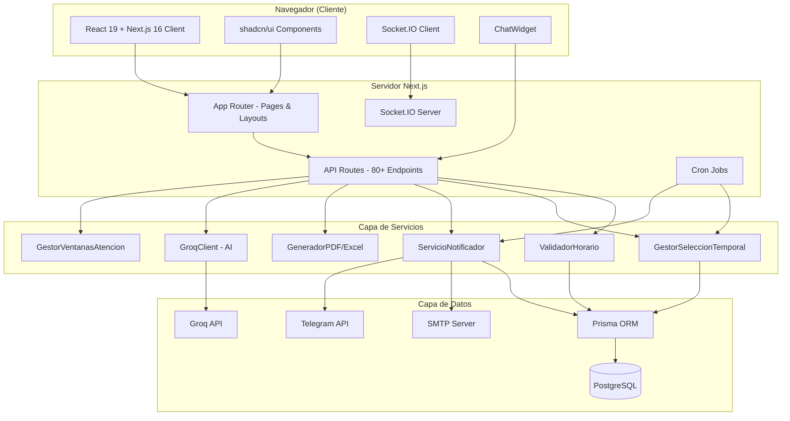
```mermaid
graph TB
    subgraph "Navegador (Cliente)"
        A[React 19 + Next.js 16 Client]
        B[shadcn/ui Components]
        C[Socket.IO Client]
        D[ChatWidget]
    end

    subgraph "Servidor Next.js"
        E[App Router - Pages & Layouts]
        F[API Routes - 80+ Endpoints]
        G[Socket.IO Server]
        H[Cron Jobs]
    end

    subgraph "Capa de Servicios"
        I[ValidadorHorario]
        J[GestorSeleccionTemporal]
        K[ServicioNotificador]
        L[GeneradorPDF/Excel]
        M[GroqClient - AI]
        N[GestorVentanasAtencion]
    end

    subgraph "Capa de Datos"
        O[Prisma ORM]
        P[(PostgreSQL)]
        Q[SMTP Server]
        R[Telegram API]
        S[Groq API]
    end

    A --> E
    B --> E
    C --> G
    D --> F
    E --> F
    F --> I
    F --> J
    F --> K
    F --> L
    F --> M
    F --> N
    I --> O
    J --> O
    K --> O
    O --> P
    K --> Q
    K --> R
    M --> S
    H --> J
    H --> K
```

### 42.2. Flujo de Navegación

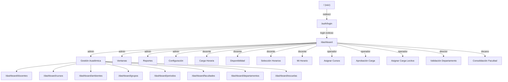
```mermaid
graph TD
    A["/ (raíz)"] -->|redirect| B["/auth/login"]
    B -->|login exitoso| C["/dashboard"]
    
    C -->|admin| D["Gestión Académica"]
    C -->|admin| E["Ventanas"]
    C -->|admin| F["Reportes"]
    C -->|admin| G["Configuración"]
    
    C -->|docente| H["Carga Horaria"]
    C -->|docente| I["Disponibilidad"]
    C -->|docente| J["Selección Horarios"]
    C -->|docente| K["Mi Horario"]
    
    C -->|operador| L["Asignar Cursos"]
    C -->|operador| M["Aprobación Carga"]
    C -->|operador| N["Asignar Carga Lectiva"]
    
    C -->|director| O["Validación Departamento"]
    C -->|decano| P["Consolidación Facultad"]
    
    D --> D1["/dashboard/docentes"]
    D --> D2["/dashboard/cursos"]
    D --> D3["/dashboard/ambientes"]
    D --> D4["/dashboard/grupos"]
    D --> D5["/dashboard/periodos"]
    D --> D6["/dashboard/facultades"]
    D --> D7["/dashboard/departamentos"]
    D --> D8["/dashboard/escuelas"]
```

### 42.3. Diagrama de Casos de Uso

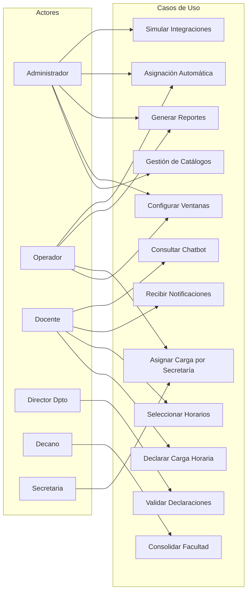
```mermaid
graph LR
    subgraph "Actores"
        Admin[Administrador]
        Op[Operador]
        Doc[Docente]
        Dir[Director Dpto]
        Dec[Decano]
        Sec[Secretaria]
    end

    subgraph "Casos de Uso"
        CU1[Gestión de Catálogos]
        CU2[Configurar Ventanas]
        CU3[Declarar Carga Horaria]
        CU4[Seleccionar Horarios]
        CU5[Asignar Carga por Secretaría]
        CU6[Validar Declaraciones]
        CU7[Consolidar Facultad]
        CU8[Generar Reportes]
        CU9[Recibir Notificaciones]
        CU10[Consultar Chatbot]
        CU11[Asignación Automática]
        CU12[Simular Integraciones]
    end

    Admin --> CU1
    Admin --> CU2
    Admin --> CU8
    Admin --> CU11
    Admin --> CU12
    
    Op --> CU2
    Op --> CU5
    Op --> CU8
    Op --> CU11
    
    Doc --> CU3
    Doc --> CU4
    Doc --> CU9
    Doc --> CU10
    
    Dir --> CU6
    Dec --> CU7
    Sec --> CU5
```

### 42.4. Diagrama de Secuencia: Selección de Horarios

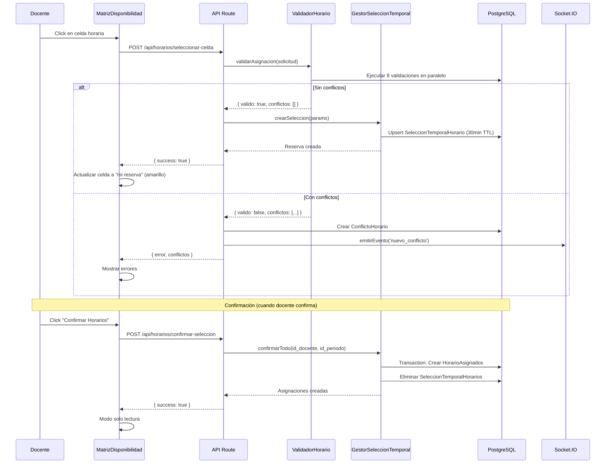
```mermaid
sequenceDiagram
    participant D as Docente
    participant UI as MatrizDisponibilidad
    participant API as API Route
    participant V as ValidadorHorario
    participant GST as GestorSeleccionTemporal
    participant DB as PostgreSQL
    participant WS as Socket.IO

    D->>UI: Click en celda horaria
    UI->>API: POST /api/horarios/seleccionar-celda
    API->>V: validarAsignacion(solicitud)
    V->>DB: Ejecutar 8 validaciones en paralelo
    
    alt Sin conflictos
        V-->>API: { valido: true, conflictos: [] }
        API->>GST: crearSeleccion(params)
        GST->>DB: Upsert SeleccionTemporalHorario (30min TTL)
        GST-->>API: Reserva creada
        API-->>UI: { success: true }
        UI->>UI: Actualizar celda a "mi reserva" (amarillo)
    else Con conflictos
        V-->>API: { valido: false, conflictos: [...] }
        API->>DB: Crear ConflictoHorario
        API->>WS: emitirEvento('nuevo_conflicto')
        API-->>UI: { error, conflictos }
        UI->>UI: Mostrar errores
    end

    Note over D, DB: Confirmación (cuando docente confirma)
    D->>UI: Click "Confirmar Horarios"
    UI->>API: POST /api/horarios/confirmar-seleccion
    API->>GST: confirmarTodo(id_docente, id_periodo)
    GST->>DB: Transaction: Crear HorarioAsignados
    GST->>DB: Eliminar SeleccionTemporalHorarios
    GST-->>API: Asignaciones creadas
    API-->>UI: { success: true }
    UI->>UI: Modo solo lectura
```

### 42.5. Diagrama de Secuencia: Notificación de Ventana

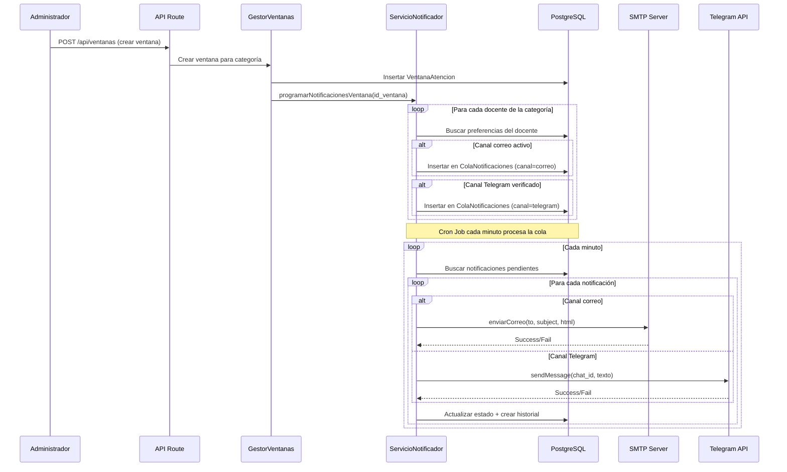
```mermaid
sequenceDiagram
    participant Admin as Administrador
    participant API as API Route
    participant GV as GestorVentanas
    participant SN as ServicioNotificador
    participant DB as PostgreSQL
    participant Mail as SMTP Server
    participant TG as Telegram API

    Admin->>API: POST /api/ventanas (crear ventana)
    API->>GV: Crear ventana para categoría
    GV->>DB: Insertar VentanaAtencion
    GV->>SN: programarNotificacionesVentana(id_ventana)
    
    loop Para cada docente de la categoría
        SN->>DB: Buscar preferencias del docente
        alt Canal correo activo
            SN->>DB: Insertar en ColaNotificaciones (canal=correo)
        end
        alt Canal Telegram verificado
            SN->>DB: Insertar en ColaNotificaciones (canal=telegram)
        end
    end

    Note over SN, DB: Cron Job cada minuto procesa la cola
    
    loop Cada minuto
        SN->>DB: Buscar notificaciones pendientes
        loop Para cada notificación
            alt Canal correo
                SN->>Mail: enviarCorreo(to, subject, html)
                Mail-->>SN: Success/Fail
            else Canal Telegram
                SN->>TG: sendMessage(chat_id, texto)
                TG-->>SN: Success/Fail
            end
            SN->>DB: Actualizar estado + crear historial
        end
    end
```

### 42.6. Diagrama de Secuencia: Autenticación

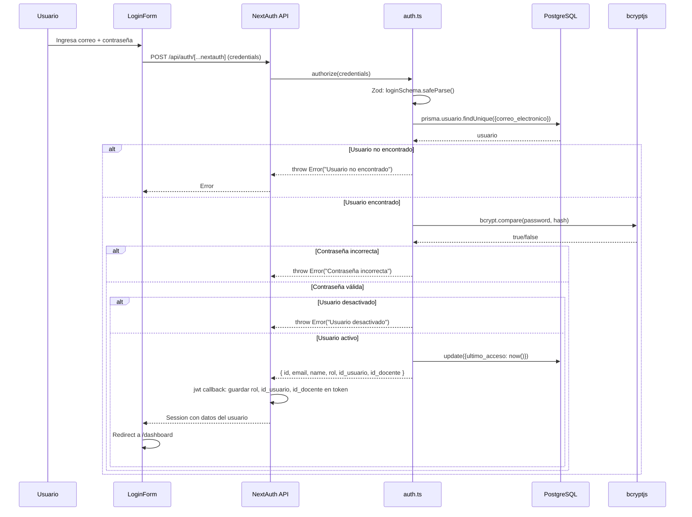
```mermaid
sequenceDiagram
    participant U as Usuario
    participant UI as LoginForm
    participant NA as NextAuth API
    participant AUTH as auth.ts
    participant DB as PostgreSQL
    participant BC as bcryptjs

    U->>UI: Ingresa correo + contraseña
    UI->>NA: POST /api/auth/[...nextauth] (credentials)
    NA->>AUTH: authorize(credentials)
    AUTH->>AUTH: Zod: loginSchema.safeParse()
    AUTH->>DB: prisma.usuario.findUnique({correo_electronico})
    DB-->>AUTH: usuario
    
    alt Usuario no encontrado
        AUTH-->>NA: throw Error("Usuario no encontrado")
        NA-->>UI: Error
    else Usuario encontrado
        AUTH->>BC: bcrypt.compare(password, hash)
        BC-->>AUTH: true/false
        
        alt Contraseña incorrecta
            AUTH-->>NA: throw Error("Contraseña incorrecta")
        else Contraseña válida
            alt Usuario desactivado
                AUTH-->>NA: throw Error("Usuario desactivado")
            else Usuario activo
                AUTH->>DB: update({ultimo_acceso: now()})
                AUTH-->>NA: { id, email, name, rol, id_usuario, id_docente }
                NA->>NA: jwt callback: guardar rol, id_usuario, id_docente en token
                NA-->>UI: Session con datos del usuario
                UI->>UI: Redirect a /dashboard
            end
        end
    end
```

### 42.7. Diagrama de Secuencia: Flujo CRUD

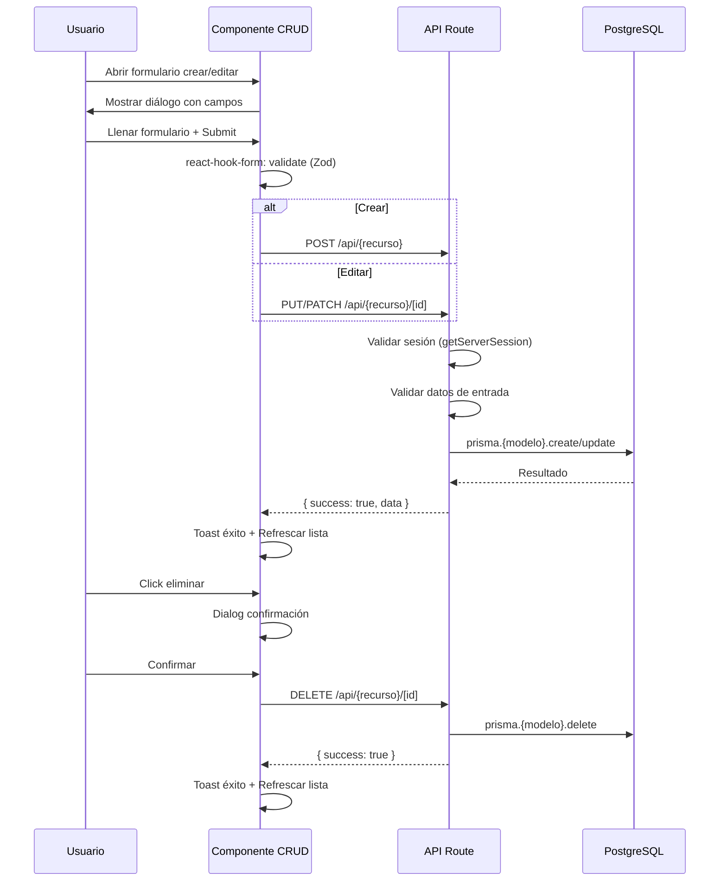
```mermaid
sequenceDiagram
    participant U as Usuario
    participant UI as Componente CRUD
    participant API as API Route
    participant DB as PostgreSQL

    U->>UI: Abrir formulario crear/editar
    UI->>U: Mostrar diálogo con campos
    
    U->>UI: Llenar formulario + Submit
    UI->>UI: react-hook-form: validate (Zod)
    
    alt Crear
        UI->>API: POST /api/{recurso}
    else Editar
        UI->>API: PUT/PATCH /api/{recurso}/[id]
    end
    
    API->>API: Validar sesión (getServerSession)
    API->>API: Validar datos de entrada
    API->>DB: prisma.{modelo}.create/update
    DB-->>API: Resultado
    API-->>UI: { success: true, data }
    UI->>UI: Toast éxito + Refrescar lista
    
    U->>UI: Click eliminar
    UI->>UI: Dialog confirmación
    U->>UI: Confirmar
    UI->>API: DELETE /api/{recurso}/[id]
    API->>DB: prisma.{modelo}.delete
    API-->>UI: { success: true }
    UI->>UI: Toast éxito + Refrescar lista
```

### 42.8. Flujo de Autenticación

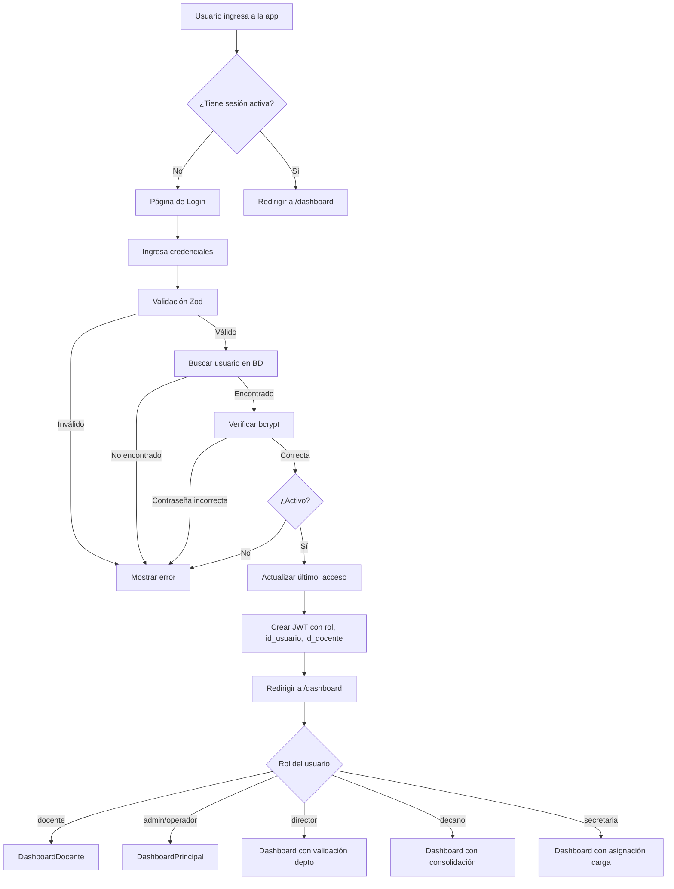
```mermaid
flowchart TD
    A[Usuario ingresa a la app] --> B{¿Tiene sesión activa?}
    B -->|No| C[Página de Login]
    B -->|Sí| D[Redirigir a /dashboard]
    
    C --> E[Ingresa credenciales]
    E --> F[Validación Zod]
    F -->|Inválido| G[Mostrar error]
    F -->|Válido| H[Buscar usuario en BD]
    
    H -->|No encontrado| G
    H -->|Encontrado| I[Verificar bcrypt]
    I -->|Contraseña incorrecta| G
    I -->|Correcta| J{¿Activo?}
    J -->|No| G
    J -->|Sí| K[Actualizar último_acceso]
    K --> L[Crear JWT con rol, id_usuario, id_docente]
    L --> M[Redirigir a /dashboard]
    
    M --> N{Rol del usuario}
    N -->|docente| O[DashboardDocente]
    N -->|admin/operador| P[DashboardPrincipal]
    N -->|director| Q[Dashboard con validación depto]
    N -->|decano| R[Dashboard con consolidación]
    N -->|secretaria| S[Dashboard con asignación carga]
```

### 42.9. Flujo de Autenticación → Autorización por Rol

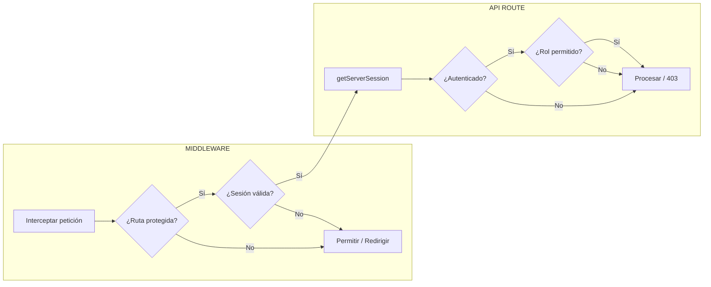
```mermaid
flowchart LR
    subgraph "MIDDLEWARE"
        M1[Interceptar petición]
        M2{¿Ruta protegida?}
        M3{¿Sesión válida?}
        M4[Permitir / Redirigir]
    end

    subgraph "API ROUTE"
        A1[getServerSession]
        A2{¿Autenticado?}
        A3{¿Rol permitido?}
        A4[Procesar / 403]
    end

    M1 --> M2
    M2 -->|No| M4
    M2 -->|Sí| M3
    M3 -->|No| M4
    M3 -->|Sí| A1

    A1 --> A2
    A2 -->|No| A4
    A2 -->|Sí| A3
    A3 -->|No| A4
    A3 -->|Sí| A4
```

### 42.10. Comunicación Frontend → Backend

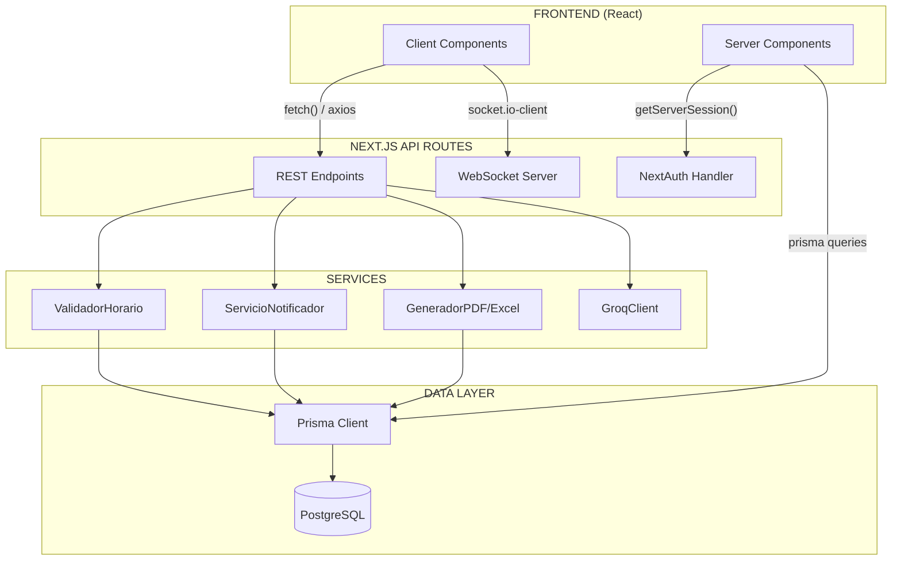
```mermaid
flowchart TB
    subgraph "FRONTEND (React)"
        FC[Client Components]
        SP[Server Components]
    end

    subgraph "NEXT.JS API ROUTES"
        REST[REST Endpoints]
        WS[WebSocket Server]
        AUTH[NextAuth Handler]
    end

    subgraph "SERVICES"
        VAL[ValidadorHorario]
        NOT[ServicioNotificador]
        RPT[GeneradorPDF/Excel]
        AI[GroqClient]
    end

    subgraph "DATA LAYER"
        PRISMA[Prisma Client]
        PG[(PostgreSQL)]
    end

    FC -->|"fetch() / axios"| REST
    FC -->|"socket.io-client"| WS
    SP -->|"getServerSession()"| AUTH
    SP -->|"prisma queries"| PRISMA

    REST --> VAL
    REST --> NOT
    REST --> RPT
    REST --> AI

    VAL --> PRISMA
    NOT --> PRISMA
    RPT --> PRISMA
    PRISMA --> PG
```

### 42.11. Comunicación Cliente → Servidor → Base de Datos

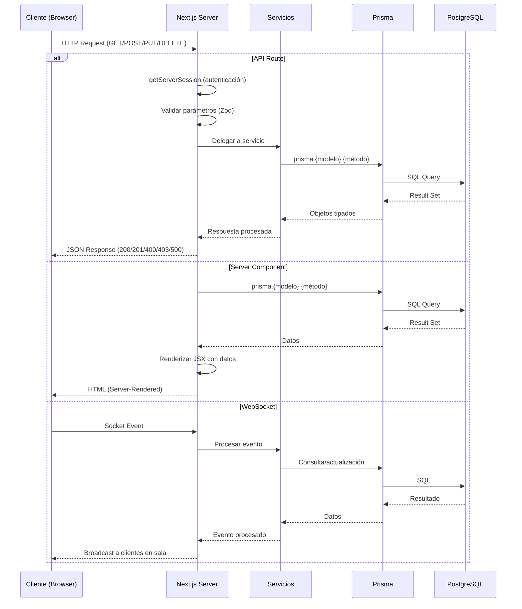
```mermaid
sequenceDiagram
    participant C as Cliente (Browser)
    participant N as Next.js Server
    participant S as Servicios
    participant P as Prisma
    participant D as PostgreSQL

    C->>N: HTTP Request (GET/POST/PUT/DELETE)
    
    alt API Route
        N->>N: getServerSession (autenticación)
        N->>N: Validar parámetros (Zod)
        N->>S: Delegar a servicio
        S->>P: prisma.{modelo}.{método}
        P->>D: SQL Query
        D-->>P: Result Set
        P-->>S: Objetos tipados
        S-->>N: Respuesta procesada
        N-->>C: JSON Response (200/201/400/403/500)
    else Server Component
        N->>P: prisma.{modelo}.{método}
        P->>D: SQL Query
        D-->>P: Result Set
        P-->>N: Datos
        N->>N: Renderizar JSX con datos
        N-->>C: HTML (Server-Rendered)
    else WebSocket
        C->>N: Socket Event
        N->>S: Procesar evento
        S->>P: Consulta/actualización
        P->>D: SQL
        D-->>P: Resultado
        P-->>S: Datos
        S-->>N: Evento procesado
        N-->>C: Broadcast a clientes en sala
    end
```

### 42.12. Dependencias entre Módulos

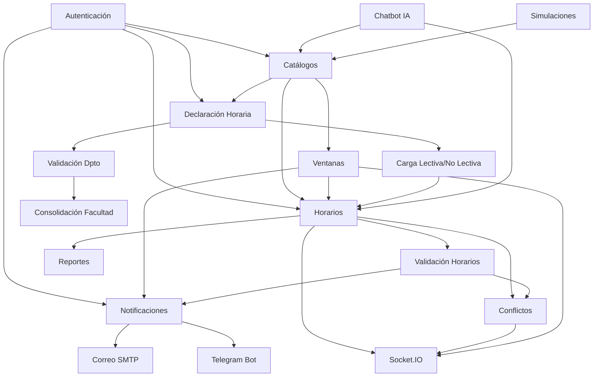
```mermaid
graph TD
    AUTH[Autenticación] --> CAT[Catálogos]
    AUTH --> HOR[Horarios]
    AUTH --> DECL[Declaración Horaria]
    AUTH --> NOTI[Notificaciones]
    
    CAT --> HOR
    CAT --> DECL
    CAT --> VENT[Ventanas]
    
    VENT --> HOR
    VENT --> NOTI
    
    DECL --> CARGA[Carga Lectiva/No Lectiva]
    CARGA --> HOR
    
    HOR --> VALID[Validación Horarios]
    HOR --> REP[Reportes]
    HOR --> CONF[Conflictos]
    
    VALID --> NOTI
    VALID --> CONF
    
    NOTI --> CORREO[Correo SMTP]
    NOTI --> TELEGRAM[Telegram Bot]
    
    HOR --> SOCK[Socket.IO]
    CONF --> SOCK
    VENT --> SOCK
    
    DECL --> VALID_DPTO[Validación Dpto]
    VALID_DPTO --> CONSOLID[Consolidación Facultad]
    
    CHATBOT[Chatbot IA] --> CAT
    CHATBOT --> HOR
    
    SIM[Simulaciones] --> CAT
```

### 42.13. Estructura de Carpetas (Diagrama)

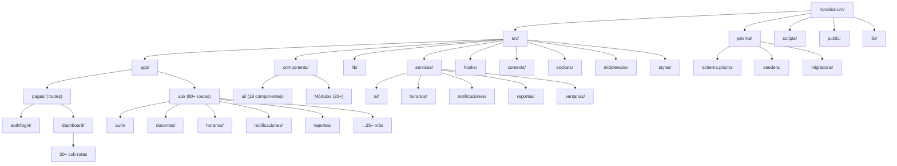
```mermaid
graph TD
    ROOT["horarios-unt/"] --> SRC["src/"]
    ROOT --> PRISMA["prisma/"]
    ROOT --> SCRIPTS["scripts/"]
    ROOT --> PUBLIC["public/"]
    ROOT --> LIB["lib/"]
    
    SRC --> APP["app/"]
    SRC --> COMP["components/"]
    SRC --> SRCLIB["lib/"]
    SRC --> SERVICES["services/"]
    SRC --> HOOKS["hooks/"]
    SRC --> CTX["contexts/"]
    SRC --> SOCKETS["sockets/"]
    SRC --> MIDDLEWARE["middleware/"]
    SRC --> STYLES["styles/"]
    
    APP --> PAGES["pages/ (routes)"]
    APP --> API["api/ (80+ routes)"]
    
    PAGES --> AUTH_PAGE["auth/login/"]
    PAGES --> DASH_PAGE["dashboard/"]
    
    DASH_PAGE --> D_SUB["30+ sub-rutas"]
    
    API --> A_AUTH["auth/"]
    API --> A_DOC["docentes/"]
    API --> A_HOR["horarios/"]
    API --> A_NOTI["notificaciones/"]
    API --> A_REP["reportes/"]
    API --> A_MORE["...25+ más"]
    
    COMP --> C_UI["ui/ (19 componentes)"]
    COMP --> C_MOD["Módulos (20+)"]
    
    SERVICES --> S_AI["ai/"]
    SERVICES --> S_HOR["horarios/"]
    SERVICES --> S_NOTI["notificaciones/"]
    SERVICES --> S_REP["reportes/"]
    SERVICES --> S_VENT["ventanas/"]
    
    PRISMA --> SCHEMA["schema.prisma"]
    PRISMA --> SEEDERS["seeders/"]
    PRISMA --> MIGRATIONS["migrations/"]
```

### 42.14. Diagrama de Componentes UML


```mermaid
graph TB
    subgraph PRESENTATION["Capa de Presentación"]
        direction TB
        PAGES["App Router Pages<br/>(31 page.tsx)"]
        LAYOUTS["Layouts<br/>(root + dashboard)"]
        COMP_MOD["Componentes de Módulo<br/>(~40 componentes)"]
        COMP_UI["Componentes UI<br/>(shadcn/ui × 19)"]
        CHATBOT_UI["ChatWidget"]
    end

    subgraph STATE["Capa de Estado"]
        CTX_PERIOD["PeriodoContext"]
        CTX_DEPT["DepartmentContext"]
        CTX_LOCALE["LocaleContext"]
        HOOKS["Hooks<br/>(useChat, useWebSocket,<br/>useVoiceRecognition)"]
    end

    subgraph API_LAYER["Capa de API Routes"]
        direction TB
        AUTH_API["Auth Routes<br/>[...nextauth]<br/>me / verify-admin<br/>check-access"]
        CRUD_API["CRUD Routes<br/>ambientes / ciclos / cursos<br/>docentes / grupos / periodos<br/>facultades / departamentos<br/>escuelas / usuarios"]
        HORARIO_API["Horario Routes<br/>seleccionar-celda<br/>confirmar-seleccion<br/>disponibilidad-matriz<br/>asignacion-automatica<br/>validar / resetear"]
        DECL_API["Declaración Routes<br/>declaracion-horaria<br/>carga-lectiva<br/>carga-no-lectiva<br/>carga-lectiva-adicional"]
        NOTI_API["Notificación Routes<br/>preferencias<br/>docente / admin"]
        REP_API["Reporte Routes<br/>pdf / excel"]
        OTROS_API["Otros Routes<br/>chatbot / conflictos<br/>dashboard/stats<br/>ventanas / simulaciones<br/>telegram/webhook"]
    end

    subgraph SERVICES["Capa de Servicios"]
        S_VALID["ValidadorHorario<br/>(8 validaciones)"]
        S_GST["GestorSeleccionTemporal<br/>(reservas 30min)"]
        S_GV["GestorVentanasAtencion"]
        S_NOTI["ServicioNotificador<br/>(cola + envío)"]
        S_CORREO["ServicioCorreo<br/>(SMTP)"]
        S_TG["ServicioTelegram<br/>(Bot API)"]
        S_PDF["GeneradorPDF<br/>(Puppeteer)"]
        S_EXCEL["GeneradorExcel<br/>(ExcelJS)"]
        S_ESTAD["ServicioEstadisticas"]
        S_GROQ["GroqClient<br/>(Llama 4 Scout)"]
        S_CHATBOT["ChatbotService"]
        S_KNOWLEDGE["SystemKnowledge<br/>(KB del sistema)"]
    end

    subgraph INFRA["Capa de Infraestructura"]
        PRISMA_C["Prisma Client<br/>(singleton)"]
        SOCKET_S["Socket.IO Server<br/>(eventos realtime)"]
        SOCKET_C["Socket.IO Client<br/>(useWebSocket)"]
        CRON["Cron Jobs<br/>(node-cron)"]
        TG_POLL["Telegram Polling<br/>(dev mode)"]
    end

    subgraph EXTERNAL["Sistemas Externos"]
        DB[("PostgreSQL")]
        SMTP["SMTP Server<br/>(Gmail)"]
        TG_API["Telegram Bot API"]
        GROQ_API["Groq API<br/>(Meta Llama)"]
        PUPPETEER["Puppeteer<br/>(Headless Chrome)"]
    end

    PAGES --> COMP_MOD
    PAGES --> LAYOUTS
    COMP_MOD --> COMP_UI
    COMP_MOD --> CTX_PERIOD
    COMP_MOD --> CTX_DEPT
    COMP_MOD --> CTX_LOCALE
    COMP_MOD --> HOOKS
    CHATBOT_UI --> HOOKS

    PAGES --> AUTH_API
    PAGES --> CRUD_API
    PAGES --> HORARIO_API
    PAGES --> DECL_API
    PAGES --> NOTI_API
    PAGES --> REP_API
    PAGES --> OTROS_API

    HORARIO_API --> S_VALID
    HORARIO_API --> S_GST
    HORARIO_API --> S_GV
    NOTI_API --> S_NOTI
    REP_API --> S_PDF
    REP_API --> S_EXCEL
    REP_API --> S_ESTAD
    OTROS_API --> S_GROQ

    S_NOTI --> S_CORREO
    S_NOTI --> S_TG
    S_GROQ --> S_CHATBOT
    S_CHATBOT --> S_KNOWLEDGE

    S_VALID --> PRISMA_C
    S_GST --> PRISMA_C
    S_GV --> PRISMA_C
    S_NOTI --> PRISMA_C
    S_PDF --> PUPPETEER
    S_CORREO --> SMTP
    S_TG --> TG_API
    S_GROQ --> GROQ_API

    PRISMA_C --> DB
    SOCKET_S --> DB
    CRON --> S_GST
    CRON --> S_NOTI
    CRON --> TG_POLL
    TG_POLL --> TG_API
    HOOKS --> SOCKET_C
    SOCKET_C --> SOCKET_S
```

### 42.15. Diagrama de Despliegue

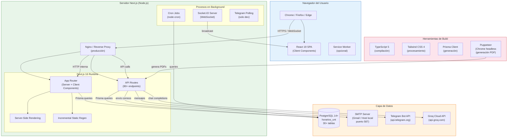
```mermaid
graph TB
    subgraph CLIENTE["Navegador del Usuario"]
        BROWSER["Chrome / Firefox / Edge"]
        REACT_APP["React 19 SPA<br/>(Client Components)"]
        SW["Service Worker<br/>(opcional)"]
        BROWSER --> REACT_APP
    end

    subgraph SERVIDOR["Servidor Next.js (Node.js)"]
        direction TB
        NGINX["Nginx / Reverse Proxy<br/>(producción)"]
        
        subgraph NEXTJS["Next.js 16 Runtime"]
            APP_ROUTER["App Router<br/>(Server + Client Components)"]
            API_ROUTES["API Routes<br/>(80+ endpoints)"]
            SSR["Server-Side Rendering"]
            ISR["Incremental Static Regen"]
        end
        
        subgraph PROCESOS["Procesos en Background"]
            CRON_JOBS["Cron Jobs<br/>(node-cron)"]
            SOCKET_IO["Socket.IO Server<br/>(WebSocket)"]
            TELEGRAM_POLL["Telegram Polling<br/>(solo dev)"]
        end
        
        NGINX --> APP_ROUTER
        NGINX --> API_ROUTES
        APP_ROUTER --> SSR
        APP_ROUTER --> ISR
    end

    subgraph DATABASE_LAYER["Capa de Datos"]
        direction LR
        PG[("PostgreSQL 14+<br/>horarios_unt<br/>30+ tablas")]
        SMTP_SVR["SMTP Server<br/>(Gmail / Host local<br/>puerto 587)"]
        TELEGRAM_SVR["Telegram Bot API<br/>(api.telegram.org)"]
        GROQ_SVR["Groq Cloud API<br/>(api.groq.com)"]
    end

    subgraph HERRAMIENTAS["Herramientas de Build"]
        TSC["TypeScript 5<br/>(compilación)"]
        TAILWIND["Tailwind CSS 4<br/>(procesamiento)"]
        PRISMA_GEN["Prisma Client<br/>(generación)"]
        PUPPETEER_SVR["Puppeteer<br/>(Chrome headless<br/>(generación PDF)"]
    end

    BROWSER -->|"HTTPS / WebSocket"| NGINX
    NGINX -->|"HTTP interna"| APP_ROUTER
    NGINX -->|"API calls"| API_ROUTES
    
    APP_ROUTER -->|"Prisma queries"| PG
    API_ROUTES -->|"Prisma queries"| PG
    CRON_JOBS -->|"queries"| PG
    SOCKET_IO -->|"broadcast"| REACT_APP
    
    API_ROUTES -->|"envío correos"| SMTP_SVR
    API_ROUTES -->|"mensajes"| TELEGRAM_SVR
    API_ROUTES -->|"chat completions"| GROQ_SVR
    
    PUPPETEER_SVR -->|"genera PDFs"| API_ROUTES

    style CLIENTE fill:#e3f2fd,stroke:#1565c0
    style SERVIDOR fill:#e8f5e9,stroke:#2e7d32
    style DATABASE_LAYER fill:#fff3e0,stroke:#ef6c00
    style HERRAMIENTAS fill:#fce4ec,stroke:#c62828
```

### 42.16. Diagrama de Paquetes


```mermaid
graph TB
    subgraph ROOT["horarios-unt/"]
        direction TB
        
        subgraph PKG_APP["package: app"]
            direction LR
            PKG_AUTH["auth/<br/>login/page.tsx"]
            PKG_DASH["dashboard/<br/>(30+ sub-rutas)"]
            PKG_API["api/<br/>(80+ route.ts)"]
        end

        subgraph PKG_COMPONENTS["package: components"]
            direction LR
            PKG_UI["ui/<br/>(19 primitivas<br/>shadcn)"]
            PKG_AUTH_COMP["auth/<br/>(LoginForm,<br/>ProteccionVentana)"]
            PKG_DASH_COMP["dashboard/<br/>(DashboardStats,<br/>GestorNotificaciones)"]
            PKG_HORARIO_COMP["horarios/<br/>(MatrizDisponibilidad,<br/>HorarioGrafico,<br/>MiHorarioDocenteView)"]
            PKG_MODULO_COMP["Módulos CRUD<br/>(DocenteList,<br/>CursoList, etc.)"]
            PKG_LAYOUT_COMP["layout/<br/>(ThemeToggle,<br/>PeriodoSelector,<br/>LanguageSelector)"]
            PKG_OTHER_COMP["chatbot/ reportes/<br/>ventanas/ declaracion/<br/>notificaciones/"]
        end

        subgraph PKG_LIB["package: lib"]
            direction LR
            PKG_AUTH_LIB["auth.ts<br/>prisma.ts"]
            PKG_HORARIO_LIB["horarios/<br/>disponibilidad/<br/>grupos/"]
            PKG_I18N["i18n/<br/>translations.ts"]
            PKG_MOCKS["mocks/<br/>(4 archivos)"]
            PKG_SOCKET["socket-client.ts<br/>socket-server.ts"]
            PKG_CRON["cronStarter.ts<br/>programadorTareas.ts"]
        end

        subgraph PKG_SERVICES["package: services"]
            direction LR
            PKG_SVC_AI["ai/<br/>(GroqClient,<br/>ChatbotService,<br/>SystemKnowledge)"]
            PKG_SVC_HOR["horarios/<br/>(ValidadorHorario,<br/>GestorSeleccionTemporal)"]
            PKG_SVC_NOTI["notificaciones/<br/>(ServicioNotificador,<br/>ServicioCorreo,<br/>ServicioTelegram)"]
            PKG_SVC_REP["reportes/<br/>(GeneradorPDF,<br/>GeneradorExcel)"]
            PKG_SVC_VENT["ventanas/<br/>GestorVentanasAtencion"]
        end

        subgraph PKG_STATE["package: state"]
            direction LR
            PKG_CTX["contexts/<br/>(PeriodoContext,<br/>DepartmentContext,<br/>LocaleContext)"]
            PKG_HOOKS["hooks/<br/>(useChat,<br/>useWebSocket,<br/>useVoiceRecognition)"]
        end

        subgraph PKG_INFRA["package: infrastructure"]
            direction LR
            PKG_PRISMA["prisma/<br/>(schema + seeders<br/>+ migrations)"]
            PKG_SOCKET_IO["sockets/<br/>server.ts"]
            PKG_PAGES_API["pages/api/<br/>socket.ts"]
            PKG_MIDDLEWARE["middleware/<br/>middleware.ts"]
            PKG_SCRIPTS["scripts/<br/>(20 archivos)"]
        end
    end

    PKG_APP --> PKG_COMPONENTS
    PKG_APP --> PKG_LIB
    PKG_COMPONENTS --> PKG_LIB
    PKG_COMPONENTS --> PKG_STATE
    PKG_APP --> PKG_SERVICES
    PKG_SERVICES --> PKG_LIB
    PKG_SERVICES --> PKG_PRISMA
    PKG_LIB --> PKG_PRISMA
    PKG_LIB --> PKG_SOCKET_IO
    PKG_STATE --> PKG_LIB

    style PKG_APP fill:#bbdefb,stroke:#1565c0
    style PKG_COMPONENTS fill:#c8e6c9,stroke:#2e7d32
    style PKG_LIB fill:#fff9c4,stroke:#f9a825
    style PKG_SERVICES fill:#f8bbd0,stroke:#c2185b
    style PKG_STATE fill:#d1c4e9,stroke:#512da8
    style PKG_INFRA fill:#ffccbc,stroke:#bf360c
```

### 42.17. Diagrama de Estados: Declaración Horaria

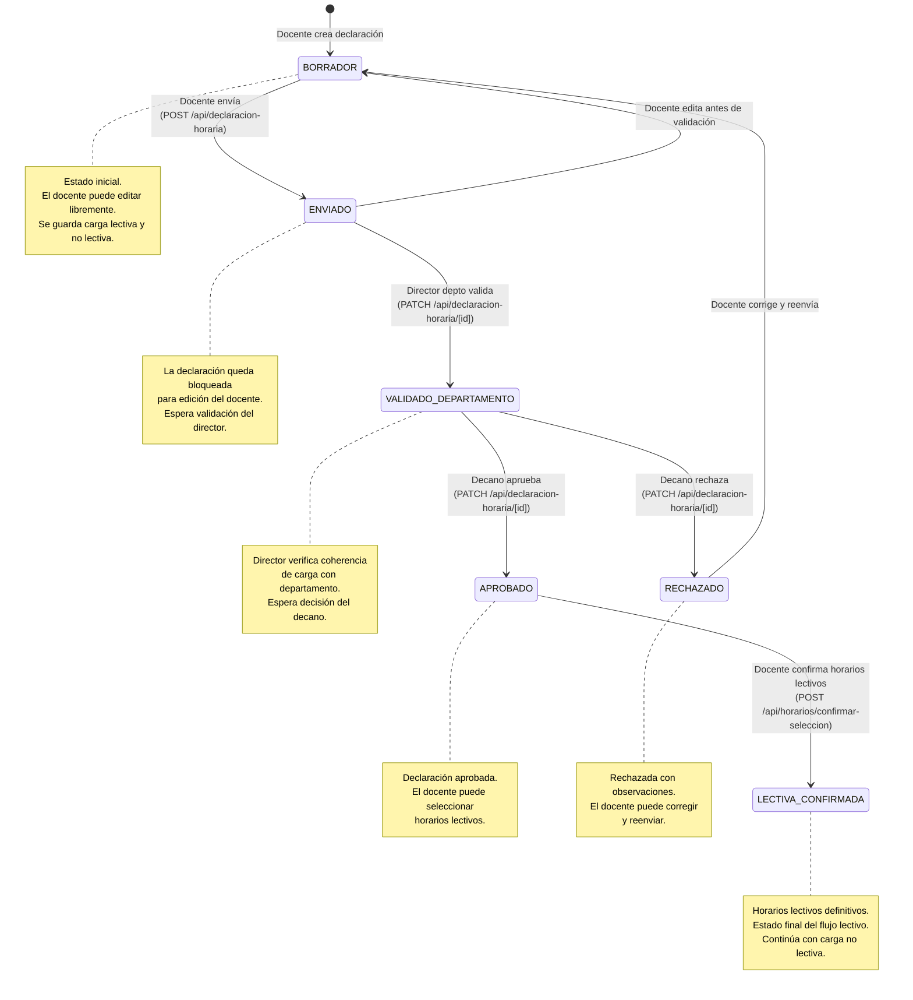
```mermaid
stateDiagram-v2
    [*] --> BORRADOR: Docente crea declaración

    BORRADOR --> ENVIADO: Docente envía<br/>(POST /api/declaracion-horaria)

    ENVIADO --> VALIDADO_DEPARTAMENTO: Director depto valida<br/>(PATCH /api/declaracion-horaria/[id])

    VALIDADO_DEPARTAMENTO --> APROBADO: Decano aprueba<br/>(PATCH /api/declaracion-horaria/[id])

    VALIDADO_DEPARTAMENTO --> RECHAZADO: Decano rechaza<br/>(PATCH /api/declaracion-horaria/[id])

    RECHAZADO --> BORRADOR: Docente corrige y reenvía

    ENVIADO --> BORRADOR: Docente edita antes de validación

    APROBADO --> LECTIVA_CONFIRMADA: Docente confirma horarios lectivos<br/>(POST /api/horarios/confirmar-seleccion)

    note right of BORRADOR
        Estado inicial.
        El docente puede editar libremente.
        Se guarda carga lectiva y no lectiva.
    end note

    note right of ENVIADO
        La declaración queda bloqueada
        para edición del docente.
        Espera validación del director.
    end note

    note right of VALIDADO_DEPARTAMENTO
        Director verifica coherencia
        de carga con departamento.
        Espera decisión del decano.
    end note

    note right of APROBADO
        Declaración aprobada.
        El docente puede seleccionar
        horarios lectivos.
    end note

    note right of RECHAZADO
        Rechazada con observaciones.
        El docente puede corregir
        y reenviar.
    end note

    note right of LECTIVA_CONFIRMADA
        Horarios lectivos definitivos.
        Estado final del flujo lectivo.
        Continúa con carga no lectiva.
    end note
```

### 42.18. Diagrama de Estados: Carga Lectiva Adicional (CLAD)

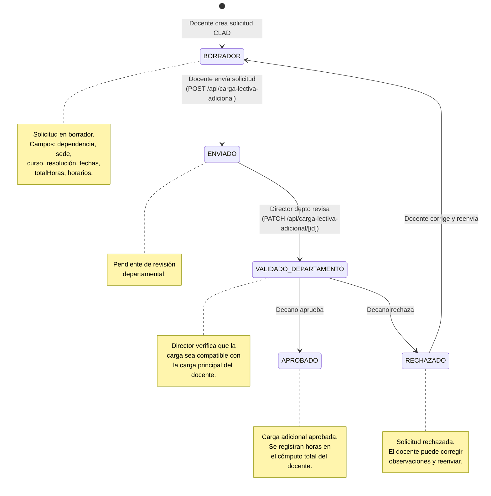
```mermaid
stateDiagram-v2
    [*] --> BORRADOR: Docente crea solicitud CLAD

    BORRADOR --> ENVIADO: Docente envía solicitud<br/>(POST /api/carga-lectiva-adicional)

    ENVIADO --> VALIDADO_DEPARTAMENTO: Director depto revisa<br/>(PATCH /api/carga-lectiva-adicional/[id])

    VALIDADO_DEPARTAMENTO --> APROBADO: Decano aprueba

    VALIDADO_DEPARTAMENTO --> RECHAZADO: Decano rechaza

    RECHAZADO --> BORRADOR: Docente corrige y reenvía

    note right of BORRADOR
        Solicitud en borrador.
        Campos: dependencia, sede,
        curso, resolución, fechas,
        totalHoras, horarios.
    end note

    note right of ENVIADO
        Pendiente de revisión
        departamental.
    end note

    note right of VALIDADO_DEPARTAMENTO
        Director verifica que la
        carga sea compatible con
        la carga principal del docente.
    end note

    note right of APROBADO
        Carga adicional aprobada.
        Se registran horas en
        el cómputo total del docente.
    end note

    note right of RECHAZADO
        Solicitud rechazada.
        El docente puede corregir
        observaciones y reenviar.
    end note
```

### 42.19. Diagrama de Estados: SeleccionTemporalHorario

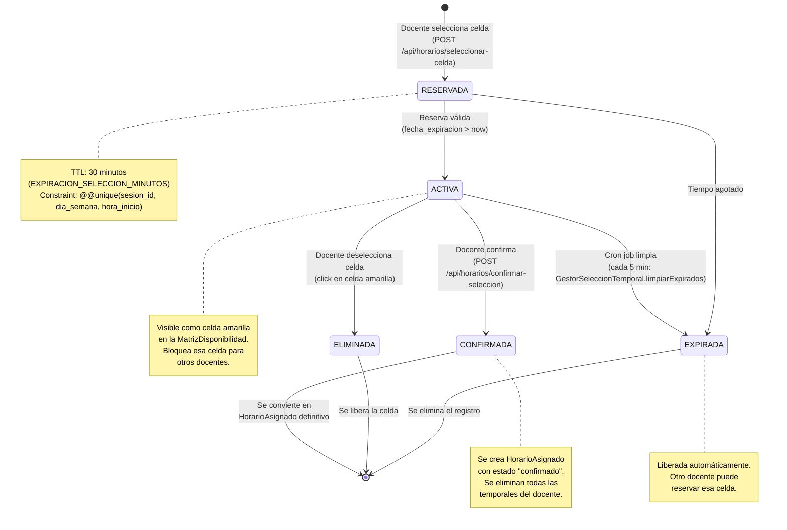
```mermaid
stateDiagram-v2
    [*] --> RESERVADA: Docente selecciona celda<br/>(POST /api/horarios/seleccionar-celda)

    RESERVADA --> ACTIVA: Reserva válida<br/>(fecha_expiracion > now)

    ACTIVA --> CONFIRMADA: Docente confirma<br/>(POST /api/horarios/confirmar-seleccion)
    ACTIVA --> ELIMINADA: Docente deselecciona celda<br/>(click en celda amarilla)
    ACTIVA --> EXPIRADA: Cron job limpia<br/>(cada 5 min: GestorSeleccionTemporal.limpiarExpirados)

    RESERVADA --> EXPIRADA: Tiempo agotado

    CONFIRMADA --> [*]: Se convierte en<br/>HorarioAsignado definitivo
    ELIMINADA --> [*]: Se libera la celda
    EXPIRADA --> [*]: Se elimina el registro

    note right of RESERVADA
        TTL: 30 minutos
        (EXPIRACION_SELECCION_MINUTOS)
        Constraint: @@unique(sesion_id, dia_semana, hora_inicio)
    end note

    note right of ACTIVA
        Visible como celda amarilla
        en la MatrizDisponibilidad.
        Bloquea esa celda para
        otros docentes.
    end note

    note right of CONFIRMADA
        Se crea HorarioAsignado
        con estado "confirmado".
        Se eliminan todas las
        temporales del docente.
    end note

    note right of EXPIRADA
        Liberada automáticamente.
        Otro docente puede
        reservar esa celda.
    end note
```

### 42.20. Diagrama de Estados: VentanaAtencion

```mermaid
stateDiagram-v2
    [*] --> CREADA: Admin crea ventana<br/>(POST /api/ventanas)

    CREADA --> ACTIVA: Admin inicia atención<br/>(PATCH /api/ventanas/[id])

    ACTIVA --> PAUSADA: Admin pausa<br/>(POST /api/ventanas/pausar)

    PAUSADA --> ACTIVA: Admin reanuda<br/>(POST /api/ventanas/pausar)

    ACTIVA --> COMPLETADA: Todos los docentes atendidos<br/>o tiempo agotado

    PAUSADA --> COMPLETADA: Cancelación definitiva

    COMPLETADA --> [*]

    note right of CREADA
        Se configuran: fecha, hora,
        intervalo (15/30/60 min),
        modalidad, categoría,
        orden_prioridad.
        Se programan notificaciones.
    end note

    note right of ACTIVA
        El sistema muestra el
        docente actual en cola.
        El intervalo avanza
        automáticamente o por
        acción del operador.
    end note

    note right of PAUSADA
        No se avanza en la cola.
        Los docentes en cola
        esperan. Se mantienen
        las notificaciones.
    end note

    note right of COMPLETADA
        Ventana finalizada.
        Los horarios restantes
        quedan como asignaciones
        definitivas.
    end note
```

### 42.21. Diagrama de Estados: ColaNotificaciones

```mermaid
stateDiagram-v2
    [*] --> PENDIENTE: ServicioNotificador<br/>crea entrada en cola

    PENDIENTE --> PROCESANDO: Cron job procesa<br/>(cada 1 min)

    PROCESANDO --> COMPLETADO: Envío exitoso<br/>(correo o Telegram)
    PROCESANDO --> FALLIDO: Error en envío

    FALLIDO --> PENDIENTE: Reintento<br/>(intentos < maximo_intentos)

    FALLIDO --> OMITIDO: Máximo de reintentos alcanzado<br/>(intentos >= 3)
    PENDIENTE --> OMITIDO: Regla de negocio<br/>(ej: correo + alerta_15min)

    COMPLETADO --> [*]: Se registra en historial
    OMITIDO --> [*]: Se registra en historial

    note right of PENDIENTE
        Estados: pendiente
        fecha_programada <= now
        intentos < 3
    end note

    note right of PROCESANDO
        ServicioNotificador
        verifica:
        1. Reglas de negocio
        2. Preferencias del docente
        3. Canal activo
    end note

    note right of COMPLETADO
        Se crea HistorialNotificaciones
        con estado_envio = "enviado".
        Se actualiza cola a "completado".
    end note

    note right of FALLIDO
        Se incrementa contador
        de intentos.
        Si intentos < 3 → reintento.
        Si intentos >= 3 → omitido.
    end note
```

### 42.22. Diagrama de Estados: HorarioAsignado

```mermaid
stateDiagram-v2
    [*] --> BORRADOR: Asignación creada<br/>(por asignación automática<br/>o confirmación manual)

    BORRADOR --> CONFIRMADO: Confirmación definitiva<br/>(POST /api/horarios/confirmar-seleccion)

    BORRADOR --> ELIMINADO: Reset de horarios<br/>(POST /api/horarios/resetear)
    CONFIRMADO --> ELIMINADO: Reset de horarios

    note right of BORRADOR
        Asignación pendiente de
        confirmación. Puede ser
        modificada o eliminada.
        Creado por:
        - Asignación automática
        - Confirmación manual
    end note

    note right of CONFIRMADO
        Asignación definitiva.
        Visible en:
        - Mi Horario Docente
        - Reportes PDF/Excel
        - Matriz de Ambientes
        No puede ser modificada
        sin reset completo.
    end note

    note right of ELIMINADO
        Asignación eliminada.
        Los ambientes y horarios
        quedan libres para
        nuevas asignaciones.
    end note
```

### 42.23. Diagrama de Secuencia: Asignación Automática de Horarios

```mermaid
sequenceDiagram
    participant Admin as Administrador
    participant UI as Dashboard
    participant API as API Route<br/>/api/horarios/asignacion-automatica
    participant V as ValidadorHorario
    participant DB as PostgreSQL
    participant WS as Socket.IO

    Admin->>UI: Click "Asignación Automática"
    UI->>API: POST /api/horarios/asignacion-automatica

    API->>DB: Obtener todas las CargaLectiva del período
    DB-->>API: Lista de cargas (curso, grupo, tipo, horas)

    API->>DB: Obtener docentes ordenados por prioridad
    DB-->>API: Docentes con DocenteCurso y CargaLectiva

    loop Para cada carga lectiva por asignar
        API->>DB: Obtener ambientes compatibles (tipo, capacidad, activo)
        DB-->>API: Ambientes disponibles

        loop Para cada hora requerida del curso
            API->>DB: Buscar slots disponibles (día × hora sin conflicto)
            
            loop Para cada slot disponible candidato
                API->>V: validarAsignacion(solicitud)
                V->>DB: Ejecutar 8 validaciones en paralelo

                alt Validación exitosa
                    V-->>API: { valido: true, conflictos: [] }
                    API->>DB: INSERT HorarioAsignado (estado: borrador)
                    API->>WS: emitirEvento('asignacion_creada')
                    Note over API: Avanzar al siguiente slot
                else Conflicto detectado
                    V-->>API: { valido: false, conflictos: [...] }
                    Note over API: Intentar siguiente slot
                end
            end
        end
    end

    API->>DB: Obtener resumen de asignaciones creadas
    DB-->>API: Estadísticas (asignadas, pendientes, conflictos)
    API-->>UI: { success: true, resumen }
    UI->>UI: Mostrar resumen con estadísticas

    Note over Admin, WS: Los conflictos no resueltos se registran<br/>en ConflictoHorario y se notifican vía WebSocket
```

### 42.24. Diagrama de Secuencia: Generación de Reportes PDF

```mermaid
sequenceDiagram
    participant U as Usuario
    participant UI as VisorReportes
    participant API as API Route<br/>/api/reportes/pdf
    participant ESTAD as ServicioEstadisticas
    participant PDF as GeneradorPDF<br/>(Puppeteer)
    participant PG as PostgreSQL
    participant CHROME as Chrome Headless

    U->>UI: Selecciona tipo de reporte<br/>y parámetros
    UI->>API: POST /api/reportes/pdf<br/>{tipo, id_periodo, parametros}

    API->>ESTAD: Obtener datos del reporte

    alt Reporte por aula
        ESTAD->>PG: SELECT horarios + ambientes + docentes
        PG-->>ESTAD: Datos consolidados
    else Reporte por docente
        ESTAD->>PG: SELECT horarios + cursos + grupos
        PG-->>ESTAD: Datos del docente
    else Reporte institucional
        ESTAD->>PG: SELECT todos los horarios + ciclos
        PG-->>ESTAD: Consolidado completo
    else Reporte de gestión
        ESTAD->>PG: SELECT estadísticas globales
        PG-->>ESTAD: KPIs y métricas
    end

    ESTAD-->>API: Datos procesados para el reporte

    API->>PDF: generarPDF({datos, plantilla, opciones})
    
    PDF->>CHROME: puppeteer.launch({headless: true})
    PDF->>CHROME: page.setContent(htmlGenerado)
    
    Note over PDF, CHROME: El HTML incluye:<br/>- Encabezado institucional UNT<br/>- Tablas de horarios<br/>- Leyendas por tipo de clase<br/>- Pie de página con fecha

    CHROME-->>PDF: PDF buffer generado
    
    PDF-->>API: Buffer del PDF
    
    API->>API: Configurar headers<br/>Content-Type: application/pdf<br/>Content-Disposition: attachment
    
    API-->>UI: Binary stream (PDF)
    UI->>UI: Descargar archivo PDF
    UI-->>U: Archivo descargado

    Note over U, CHROME: Tipos de reporte disponibles:<br/>- Horario por aula/laboratorio<br/>- Horario por docente/ciclo<br/>- Reporte institucional<br/>- Reporte de gestión<br/>- Reporte masivo de ambientes
```

### 42.25. Diagrama de Secuencia: Flujo Completo CLAD

```mermaid
sequenceDiagram
    participant Doc as Docente
    participant UI as CargaAdicional<br/>Client
    participant API as API Routes
    participant DIR as Director Dpto<br/>(UI Validación)
    participant DEC as Decano<br/>(UI Consolidación)
    participant DB as PostgreSQL
    participant NOTI as ServicioNotificador

    Note over Doc, NOTI: FASE 1: Creación de solicitud CLAD

    Doc->>UI: Accede a "Carga Adicional"
    UI->>API: GET /api/carga-lectiva-adicional?id_docente=X
    API->>DB: SELECT existing CLAD
    DB-->>API: Lista de solicitudes
    API-->>UI: Mostrar solicitudes existentes

    Doc->>UI: Click "Nueva Solicitud"
    UI->>UI: Mostrar formulario
    Doc->>UI: Llenar: dependencia, sede,<br/>curso, resolución, fechas,<br/>totalHoras, horarios
    UI->>API: POST /api/carga-lectiva-adicional<br/>{datos completos}
    API->>DB: INSERT CargaLectivaAdicional<br/>(estado: BORRADOR)
    DB-->>API: Solicitud creada
    API-->>UI: { success: true }
    UI->>Doc: Solicitud creada (borrador)

    Note over Doc, NOTI: FASE 2: Envío a validación

    Doc->>UI: Click "Enviar a Validación"
    UI->>API: PATCH /api/carga-lectiva-adicional/[id]<br/>{estado: ENVIADO}
    API->>DB: UPDATE estado
    API->>NOTI: programarNotificacion(dir_dpto, "nueva_clad")
    NOTI->>DB: INSERT ColaNotificaciones
    DB-->>API: Actualizado
    API-->>UI: Solicitud enviada
    UI->>Doc: Solicitud en proceso de validación

    Note over Doc, NOTI: FASE 3: Validación Departamental

    DIR->>API: GET /api/carga-lectiva-adicional?estado=ENVIADO
    API->>DB: SELECT solicitudes pendientes depto
    DB-->>API: Lista de solicitudes
    API-->>DIR: Mostrar solicitudes pendientes

    alt Director aprueba
        DIR->>API: PATCH /api/carga-lectiva-adicional/[id]<br/>{estado: VALIDADO_DEPARTAMENTO}
        API->>DB: UPDATE estado
        API->>NOTI: notificar(docente, "clad_validada_dpto")
    else Director rechaza
        DIR->>API: PATCH /api/carga-lectiva-adicional/[id]<br/>{estado: RECHAZADO, observaciones: "..."}
        API->>DB: UPDATE estado + observaciones
        API->>NOTI: notificar(docente, "clad_rechazada_dpto")
        Note over Doc: Docente corrige y reenvía (vuelve a FASE 2)
    end

    Note over Doc, NOTI: FASE 4: Consolidación Facultad

    DEC->>API: GET /api/consolidacion-facultad?facultadId=X
    API->>DB: SELECT solicitudes VALIDADO_DEPARTAMENTO
    DB-->>API: Lista consolidada por departamento
    API-->>DEC: Mostrar consolidado

    alt Decano aprueba
        DEC->>API: PATCH /api/consolidacion-facultad/[id]<br/>{estado: APROBADO}
        API->>DB: UPDATE estado → APROBADO
        API->>NOTI: notificar(docente, "clad_aprobada")
    else Decano rechaza
        DEC->>API: PATCH /api/consolidacion-facultad/[id]<br/>{estado: RECHAZADO}
        API->>DB: UPDATE estado → RECHAZADO
        API->>NOTI: notificar(docente, "clad_rechazada_final")
    end

    Note over Doc, NOTI: FASE 5: Notificación final

    NOTI->>DB: Procesar cola (cron cada 1 min)
    NOTI->>DB: SELECT notificaciones pendientes
    alt Canal correo
        NOTI->>NOTI: ServicioCorreo.enviarCorreo()
    else Canal Telegram
        NOTI->>NOTI: ServicioTelegram.enviarMensaje()
    end
    NOTI->>DB: INSERT HistorialNotificaciones
    NOTI->>DB: UPDATE ColaNotificaciones → completado
```

---

## 43. Dependencias del Proyecto

### 43.1. Dependencias de Producción

| Paquete | Versión | Uso en el Proyecto |
|---------|---------|-------------------|
| `next` | 16.2.6 | Framework fullstack |
| `react` | 19.2.4 | UI Library |
| `react-dom` | 19.2.4 | React DOM renderer |
| `@prisma/client` | ^6.19.3 | ORM para PostgreSQL |
| `@auth/prisma-adapter` | ^2.11.2 | Adaptador Prisma para NextAuth |
| `next-auth` | ^4.24.14 | Autenticación |
| `zod` | ^4.4.3 | Validación de esquemas |
| `react-hook-form` | ^7.75.0 | Gestión de formularios |
| `axios` | ^1.16.1 | Cliente HTTP |
| `bcryptjs` | ^3.0.3 | Hashing de contraseñas |
| `jsonwebtoken` | ^9.0.3 | Tokens JWT |
| `date-fns` | ^4.1.0 | Manipulación de fechas |
| `recharts` | ^3.8.1 | Gráficos React |
| `socket.io` | ^4.8.3 | WebSocket server |
| `socket.io-client` | ^4.8.3 | WebSocket client |
| `groq-sdk` | ^1.2.1 | Cliente Groq (IA) |
| `puppeteer` | ^24.43.1 | Generación de PDF |
| `exceljs` | ^4.4.0 | Generación de Excel |
| `xlsx` | ^0.18.5 | Manipulación Excel |
| `nodemailer` | ^7.0.13 | Envío de correos |
| `node-cron` | ^4.2.1 | Tareas programadas |
| `lucide-react` | ^1.16.0 | Iconos |
| `class-variance-authority` | ^0.7.1 | Variantes de componentes |
| `clsx` | ^2.1.1 | Clases condicionales |
| `tailwind-merge` | ^3.6.0 | Merge de clases Tailwind |
| `radix-ui` | ^1.4.3 | Primitivas de UI |
| `sonner` | ^2.0.7 | Toast notifications |
| `next-themes` | ^0.4.6 | Temas claro/oscuro |
| `shadcn` | ^4.7.0 | CLI de shadcn/ui |
| `tailwindcss-animate` | ^1.0.7 | Animaciones Tailwind |
| `tw-animate-css` | ^1.4.0 | CSS Animations |

### 43.2. Dependencias de Desarrollo

| Paquete | Versión | Uso |
|---------|---------|-----|
| `typescript` | ^5 | Tipado estático |
| `@types/node` | ^20 | Tipos de Node.js |
| `@types/react` | ^19 | Tipos de React |
| `@types/react-dom` | ^19 | Tipos de React DOM |
| `@types/bcryptjs` | ^2.4.6 | Tipos de bcryptjs |
| `@types/node-cron` | ^3.0.11 | Tipos de node-cron |
| `@types/nodemailer` | ^8.0.0 | Tipos de nodemailer |
| `prisma` | ^6.19.3 | CLI de Prisma |
| `eslint` | ^9 | Linting |
| `eslint-config-next` | 16.2.6 | Config ESLint Next.js |
| `tailwindcss` | ^4 | CSS utility framework |
| `@tailwindcss/postcss` | ^4 | PostCSS plugin |
| `ts-node` | ^10.9.2 | Ejecución TypeScript |
| `tsx` | ^4.22.3 | Ejecución TypeScript moderna |

---

## 44. Tabla de Archivos del Proyecto

### 44.1. Resumen Cuantitativo

| Categoría | Cantidad de Archivos |
|-----------|---------------------|
| API Routes (`src/app/api/`) | ~80 |
| Páginas (`src/app/**/page.tsx`) | ~31 |
| Layouts (`src/app/**/layout.tsx`) | 2 |
| Componentes (`src/components/`) | ~67 |
| Librería (`src/lib/`) | ~26 |
| Servicios (`src/services/`) | 13 |
| Hooks (`src/hooks/`) | 3 |
| Contexts (`src/contexts/`) | 3 |
| Seeders (`prisma/seeders/`) | 13 |
| Scripts (`scripts/`) | 20 |
| UI Components (`src/components/ui/`) | 19 |
| **Total aproximado** | **~300 archivos fuente** |

### 44.2. Archivos de Configuración Raíz

| Archivo | Líneas | Propósito |
|---------|--------|-----------|
| `package.json` | ~75 | Dependencias y scripts |
| `tsconfig.json` | ~25 | Configuración TypeScript |
| `next.config.ts` | ~7 | Configuración Next.js (vacía) |
| `tailwind.config.ts` | ~12 | Configuración Tailwind |
| `components.json` | ~25 | Configuración shadcn/ui |
| `eslint.config.mjs` | — | Configuración ESLint |
| `postcss.config.mjs` | — | Configuración PostCSS |
| `prisma/schema.prisma` | 701 | Esquema de base de datos |

---

**Fin del documento.**

*Documentación generada mediante análisis exhaustivo del código fuente completo del repositorio.*
*Todos los componentes, módulos, rutas y funcionalidades documentados corresponden a implementaciones reales verificadas en el código.*
